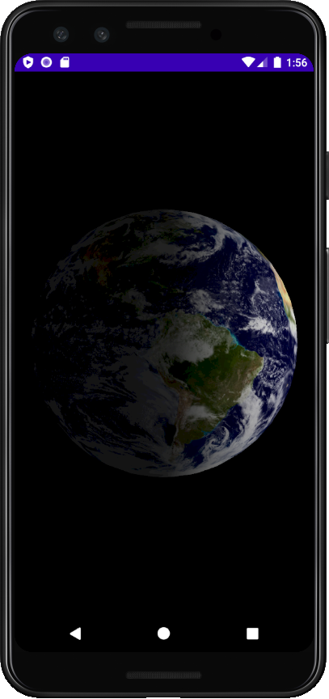
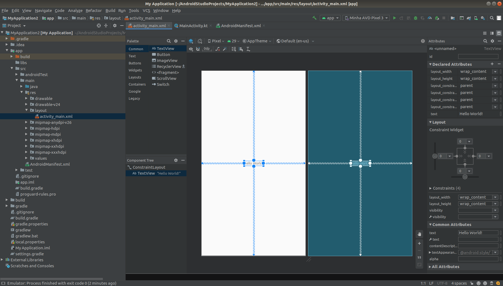

## Android Apps

[**Cleuton Sampaio**](https://github.com/cleuton)

Este é o seu **guru** de aplicações Android!

<<<<<<< HEAD
Aprenda a criar [**Renderização 3D** com **OpenGL**](./gl_kotlin): 

Aprenda a criar [**Textura e animação 3D** com **OpenGL**](./gl_texture): 

=======
Aprenda a criar [**Gráficos 3D** com **OpenGL**](./gl_kotlin/)! 

>>>>>>> 01f1ab74ba63ac39f866a1763bd7207a6b523f0c

Toque na imagem

Veja aqui nosso [**TUTORIAL de boas práticas em UX mobile**](https://youtu.be/TrqP6W381Ok) Toque na imagem para ver o vídeo!

Se você quer aprender a criar aplicações Android, então faça nosso [**CURSO BÁSICO DE DESENVOLVIMENTO COM ANDROID STUDIO E KOTLIN**](./cursobasico): 

