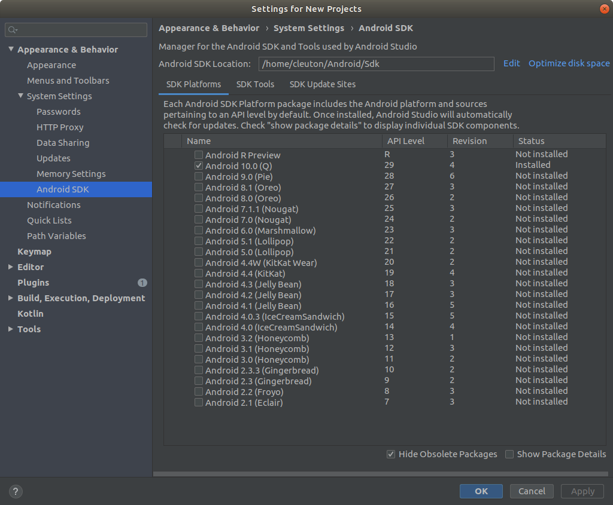
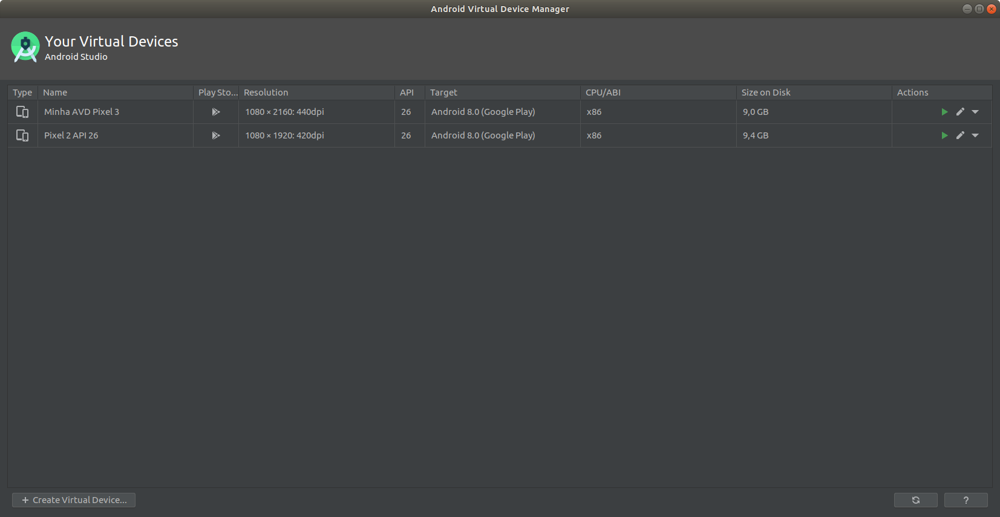

## CURSO BÁSICO DE DESENVOLVIMENTO COM ANDROID STUDIO E KOTLIN
### Sua primeira aplicação Android

[**Cleuton Sampaio**](https://github.com/cleuton)

[**Assista ao vídeo desta lição ANTES de ler este conteúdo!**](https://youtu.be/73sGG2XLM3Y)

Aprenda a criar aplicações Android utilizando o [**Android Studio**](https://developer.android.com/studio/) e a linguagem de programação [**Kotlin**](https://kotlinlang.org/).

Para criar aplicações Android, é necessário utilizar um Kit de desenvolvimento chamado [**Android SDK**](https://developer.android.com/studio/intro/update?hl=pt-br). Além disto, você necessitará de um computador com pelo menos: 
- 8 GB RAM
- 10 GB de espaço livre em disco
- Processador Intel I3, compatível ou superior
- Sistema operacional: Linux, MacOS ou Microsoft Windows

Se quiser executar as aplicações para testar em um dispositivo Android real, precisará do dispositivo e de um cabo USB (normalmente, vem com o aparelho).

## O que você precisa saber

Antes de mais nada, leia atentamente esta seção: 

1. O curso não dará qualquer tipo de certificado;
2. O curso ensinará o básico. Se você conseguir fazer os exercícios, então poderá criar aplicações simples para dispositivos Android;
3. Distribuir sua aplicação na Google Play Store está fora do escopo deste curso, mas haverá outro específico sobre isso;
4. Aplicações Android só executam em dispositivos Android. Se quiser fazer aplicação que funcione em dispositivos iOS ou iPadOS, da Apple, é necessário ter os dispositivos e aprender outro tipo de API;
5. Suas aplicações executarão no Emulador Android ou em qualquer dispositivo que você possua e conecte ao seu computador;
6. Desenvolvimento de aplicações móveis é mais complexo. É preciso ter experiência prévia de programação;
7. Este curso foi feito utilizando o Ubuntu. Ser for imprescindível dar alguma informação específica, será feito conforme o caso.

## Preparando o ambiente

A primeira coisa que você terá que fazer é baixar e instalar o [**Android Studio e o SDK**](https://developer.android.com/studio/).

As instruções de instalação podem ser lidas [**NESTE LINK**](https://developer.android.com/studio/install?hl=pt-br) para os três sistemas operacionais. 

Para **MS Windows** há um instalador, para **MacOS**, um DMG, mas para **Linux**, não há instalador algum. Você copia o arquivo, descompacta e pode executar diretamente o Android Studio: 
"android-studio/bin/studio.sh".

Após executar o Android Studio, ele lhe perguntará se quer importar as configurações e lhe guiará para instalar o Android SDK desejado. 



Há duas coisas que você deve saber sobre desenvolvimento Android: 
- [**API Level**](https://developer.android.com/guide/topics/manifest/uses-sdk-element?hl=pt-br#ApiLevels): Nível da API de desenvolvimento;
- [**Android version**](): Versão do sistema operacional Android;

O nível da API é um valor inteiro que identifica unicamente a revisão da API da biblioteca oferecida por uma versão da plataforma Android. Se você desenvolve para um determinado nível de API, está sujeito às suas limitações. 

A versão do Android está relacionada à versão do sistema operacional.

Como vê na figura, eu instalei a versão Android 10, com nível de API 29. Se surgir um nível de API maior, digamos 30, eu não poderei desenvolver com ele, a não ser que instale outro SDK.

## Aplicações Android

As aplicações Android são baseadas em iterações com o usuário, chamadas de [**Activity**](https://developer.android.com/reference/android/app/Activity). Uma Activity é uma iteração que o usuário pode ter com a aplicação, por exemplo "selecionar os destinatários de uma mensagem". 

Uma Activity é o meio pelo qual a aplicação determina a Janela (Window) e as Views (o que está sendo exibido). Temos views para todo tipo de informação, como por exemplo: 
- TextView: Exibir texto
- editText: Digitar texto
- button: Clicar

O layout de uma Activity é um arquivo XML, que determina o posicionamento relativo e as propriedades das Views. Por exemplo: 

```
<androidx.constraintlayout.widget.ConstraintLayout xmlns:android="http://schemas.android.com/apk/res/android"
    xmlns:app="http://schemas.android.com/apk/res-auto"
    xmlns:tools="http://schemas.android.com/tools"
    android:layout_width="match_parent"
    android:layout_height="match_parent"
    tools:context=".MainActivity">

    <TextView
        android:layout_width="wrap_content"
        android:layout_height="wrap_content"
        android:text="Hello World!"
        app:layout_constraintBottom_toBottomOf="parent"
        app:layout_constraintLeft_toLeftOf="parent"
        app:layout_constraintRight_toRightOf="parent"
        app:layout_constraintTop_toTopOf="parent"
        android:id="@+id/mensagem"/>

    <EditText
        android:id="@+id/editText"
        android:layout_width="wrap_content"
        android:layout_height="wrap_content"
        android:ems="10"
        android:inputType="textPersonName"
        android:text="Name"
        tools:layout_editor_absoluteX="95dp"
        tools:layout_editor_absoluteY="421dp" />

    <Button
        android:id="@+id/button"
        android:layout_width="wrap_content"
        android:layout_height="wrap_content"
        android:text="Button"
        tools:layout_editor_absoluteX="116dp"
        tools:layout_editor_absoluteY="549dp" />

</androidx.constraintlayout.widget.ConstraintLayout>
```

A programação de aplicações Android é baseada em **eventos**. Você não diz ao Android o que ele deve exibir ou fazer. Ele é quem pergunta a você, no momento certo, o que deve ser feito.

Sua aplicação é um conjunto de *activities*. 

Uma **Activity** é composta por duas partes: 
- Um layout em XML: Um arquivo que fica na pasta "res/layout";
- Um arquivo de código para responder a **eventos**: Pode ser em **Java** ou **Kotlin** e fica na pasta "src/main/java" (mesmo que seja Kotlin);


Aqui está um exemplo de código-fonte de uma Activity: 

```
package com.obomprogramador.primeiraapp

import androidx.appcompat.app.AppCompatActivity
import android.os.Bundle
import kotlinx.android.synthetic.main.activity_main.*

class MainActivity : AppCompatActivity() {

    override fun onCreate(savedInstanceState: Bundle?) {
        super.onCreate(savedInstanceState)
        setContentView(R.layout.activity_main)
        mensagem.setText("Olá, Cleuton")
    }
}
```

## Kotlin

[**Kotlin**](https://kotlinlang.org/) é a linguagem de programação padrão do Android. 

É possível desenvolver aplicações utilizando **Java**, mas, como o Android padronizou o uso de Kotlin, é melhor aprender essa linguagem. 

Você deve estar se perguntando: 

*É possível programar Android usando outras linguagens? C++, Python, C#?*

Sim, mas não com as ferramentas Android oficiais, da Google. 

Se você quiser utilizar **C#** há o [**Xamarin**](https://dotnet.microsoft.com/apps/xamarin), uma plataforma Open Source da **Microsoft**, que permite criar aplicações para Android e iOS com a mesma base de código. Mas não é específica para Android. 

Há os frameworks multiplataforma, baseados em HTML5 e Javascript, como o [**Ionic**](https://ionicframework.com/), mas também não são específicos. 

Com o Android Studio, é possível criar aplicações em Kotlin, Java e até partes em C++. 

Kotlin é uma linguagem baseada na **JVM** e totalmente compatível com Java. Na verdade, a simbiose é tão grande que você pode misturar código Java com Kotlin, fazendo uma linguagem invocar a outra.

## AVD

Se você está desenvolvendo aplicações móveis, onde as testará? Boa pergunta! 

Há duas maneiras de testar a aplicação: 
- Emulador Android (AVD): Um emulador baseado no [**QEMU**](https://developer.android.com/studio/run/emulator-commandline), ou seja, uma máquina virtual;
- Dispositivo conectado: Um dispositivo móvel Android, com [**Depuração USB habilitada**](https://developer.android.com/studio/debug/dev-options?hl=pt-br), conectado ao computador;

Você precisará baixar uma imagem de sistema para a plataforma desejada, se quiser criar instâncias do Emulador. Para isto, deverá criar uma ou mais [**Android Virtual Devices**](https://developer.android.com/studio/run/emulator).

## Android Studio

Você já viu como configurar o **SDK** no Android Studio. Pode alterar, instalar ou remover SDKs utilizando o **SDK Manager** através do menu **Tools**.

Você pode iniciar o [**AVD Manager**](https://developer.android.com/studio/run/managing-avds) e criar Imagens para usar com o Android Emulator usando o **AVD Manager** no menu **Tools**.



Clique no botão **Create Virtual Device** para criar uma nova imagem de smartphone ou tablet para rodar no Emulador. Depois, selecione o tipo de dispositivo: 


Ao clicar em **Next** você escolherá qual a versão do Android (e API Level) deverá ser instalada no dispositivo virtual: 


Finalmente, na próxima tela, você escolhe o nome da imagem, a orientação da tela inicial e algumas outras configurações: 


## Projeto

Vamos criar um projeto Kotlin para você se acostumar com o Android. 

No Android Studio, selecione **File / New / New project**. Na janela do assistente, selecione o tipo de projeto que deseja criar. Há várias opções e você pode ver pelas imagens o que elas são. Em nosso caso, vamos escolher o tipo "Empty Activity" no qual ele cria uma activity só com um texto "hello world". 


Na próxima tela do assistente, informe o nome da sua aplicação, o nome do **pacote** da aplicação, onde vai salvar o projeto, a linguagem (Kotlin) e o nível mínimo de API suportado: 


O pacote da sua aplicação será o **namespace** do seu código e também o identificador que será utilizado na **Google Play**. Geralmente, fazemos como em Java: Nome de dominio ao contrário + nome do projeto. Se não tem um nome de domínio, ou ainda não sabe, então use qualquer coisa. Mas depois terá que mudar!

O nível mínimo de API é importante, pois ele determina a compatibilidade com o Mercado! Por exemplo, se escolher a versão mais recente da API, então haverá menos usuários com aparelhos compatíveis. Veja a informação na figura: API 26 (Oreo) é compatível com 60% dos dispositivos. 

O editor tem 3 áreas básicas: 
- Lista do projeto: Onde aparece a lista de arquivos e recursos;
- Editor ou janela de código: Onde você vê o que está selecionado na lista de recursos;
- Janelas de status: Onde aparecem informações importantes, como erros ou resultados de compilações;

Se a Janela de status estiver oculta, dê um duplo-clique na última linha da tela (marcada com a seta amarela) que ela aparecerá.


Meu Android Studio está configurado com tema escuro, o padrão é tema claro. Se quiser mudar, vá no menu **File / Settings**.

Depois de criar seu projeto, examine o código da activity que está na janela de código. Apesar de parecer **Java** é **Kotlin** e você pode ver que a extensão do arquivo é **.kt**. 

```
package com.obomprogramador.myapplication

import androidx.appcompat.app.AppCompatActivity
import android.os.Bundle

class MainActivity : AppCompatActivity() {

    override fun onCreate(savedInstanceState: Bundle?) {
        super.onCreate(savedInstanceState)
        setContentView(R.layout.activity_main)
    }
}
```

A classe "MainActivity" é derivada (herança) da classe "AppCompatActivity" e tem um só método chamado "onCreate()". Na verdade, ela tem mais métodos, mas só sobrescreveu (override) este. 

Este método é parte do [**Ciclo de vida de Activity**](https://developer.android.com/guide/components/activities/activity-lifecycle) e é invocado quando a Activity é criada. 

Um método Kotlin é apenas uma função criada dentro de uma classe. Em Kotlin podemos criar apenas funções. Neste método, a primeira coisa que fazemos é invocar o construtor da superlasse e depois, usamos o método "setContentView()" para informar qual é o layout da nossa activity. 

Vamos executar o projeto em um AVD. Se ainda não criou o AVD, este é o momento de fazê-lo. 

Na barra superior (de botões) selecione o nome do seu AVD e clique no triângulo com o símbolo de "Play": 


Depois de um tempo, o Emulador será carregado e sua aplicação aparecerá nele: 


Note que, ao lado da imagem do smartphone, há um atalho com botões mais comuns. É possível ligar/desligar ou rotacionar o smartphone. E os botões Android, na parte inferior do aparelho, funcionam. Você pode navegar nele como um smartphone comum e ver até o ícone da sua app, junto com várias outras. Para sair dele, use o "x" na parte superior da barra de botões.

## Layout

Se em qualquer momento você "perder" a estrutura do seu projeto, na Lista do projeto há uma **combobox** basta selecionar **Project**. 

Como eu disse anteriormente, uma Activity é composta por uma parte de código e outra visual, com o layout das várias Views. 

Você executou a App, portanto sabe o que ela contém. Em seu centro, há um texto "Hello World", que não pode ser editado. 

Vamos ver o arquivo de layout desta activity ("activity_main.xml"). Nós não demos esse nome, pois foi gerado pelo assistente do Projeto. Mas podemos mudar isso.

Selecione na sua lista de projeto: "src/main/res/layout" e clique em "activity_main.xml". Você verá algo como isso: 


Você está vendo o layout da Activity no formato visual. Os dois retângulos (um branco e outro azul) são as visualizações em formato "design" e "blueprint", respectivamente. 

Você pode escolher se quer ver exatamente como será renderizado ("design"), ou apenas os contornos ("blueprint") ou ambas. A visualização "blueprint" é mais leve e rápida, especialmente se sua app tiver um layout muito complexo e poucos recursos de memória e processador. Para alternar entre as formas use o botão abaixo, que fica acima da janela de código (de edição): 


Você também pode alternar entre XML e visualização gráfica utilizando um dos 3 botões abaixo:


Você pode ver/editar só XML, XML e visual ou só visual. Por exemplo, esta é a visão XML do layout: 

```
<?xml version="1.0" encoding="utf-8"?>
<androidx.constraintlayout.widget.ConstraintLayout xmlns:android="http://schemas.android.com/apk/res/android"
    xmlns:app="http://schemas.android.com/apk/res-auto"
    xmlns:tools="http://schemas.android.com/tools"
    android:layout_width="match_parent"
    android:layout_height="match_parent"
    tools:context=".MainActivity">

    <TextView
        android:layout_width="wrap_content"
        android:layout_height="wrap_content"
        android:text="Hello World!"
        app:layout_constraintBottom_toBottomOf="parent"
        app:layout_constraintLeft_toLeftOf="parent"
        app:layout_constraintRight_toRightOf="parent"
        app:layout_constraintTop_toTopOf="parent" />

</androidx.constraintlayout.widget.ConstraintLayout>
```

Nela, vemos uma **TextView** com a propriedade "android:text" como: "Hello World!", ou seja, o texto que aparece ao executarmos a app. 

## TODO

Por enquanto ficamos por aqui. Você assistiu ao vídeo da aula, certo? Caso contrário, assista! O link está no topo. 

Agora, explore um pouco a app, veja os outros tipos de recursos que foram criados para você. 


