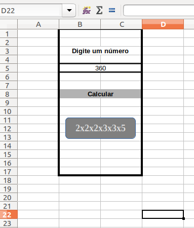
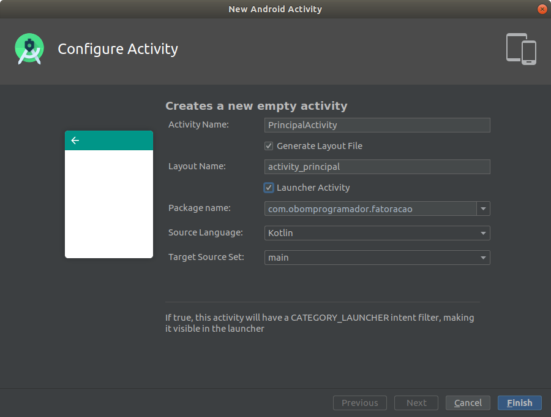
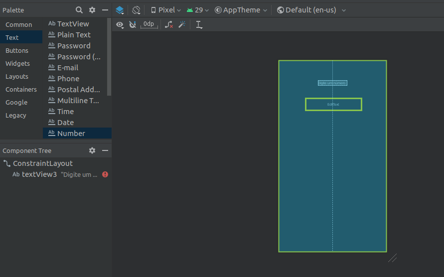

## CURSO BÁSICO DE DESENVOLVIMENTO COM ANDROID STUDIO E KOTLIN
### Contatos imediatos com Kotlin

[**Cleuton Sampaio**](https://github.com/cleuton)

[**O VÍDEO AINDA NÃO ESTÁ PRONTO**]

[**Assista ao vídeo desta lição ANTES de ler este conteúdo!**](****************************************)

Se você entrou aqui pela primeira vez, talvez seja melhor ver as [**lições do curso**](../README.md)

## Fala sério

Cara, **Kotlin** é uma linguagem de programação muito *cheirada*! Em certos casos, você escreve menos que em Java, mas as suas idiossincrasias são meio injustificáveis para mim. Sinceramente, não sei por que a **Google** optou por Kotlin para ser a nova linguagem de programação do Android, uma vez que ela tem a [**Golang**](http://golang.network) que é excelente!

Nessa lição, vamos dar umas *braçadas* no Kotlin. Este é um curso básico, objetivando lhe dar uma visão geral do desenvolvimento de apps Android usando duas ferramentas: O Android Studio e a linguagem Kotlin. Portanto, não entrarei muito a fundo na linguagem. Mas é necessário vermos alguma coisa.

Se você é programador Java, então será relativamente fácil criar apps Android com Kotlin. Até porque, se as coisas complicarem, você pode misturar código Java com ela! Pode fazer alguns scripts em Kotlin e outros em Java.

Apesar do que eu escrevi, há justificativas para Kotlin ser assim... estranha... As linguagens mais modernas são cheias de preocupações estranhas, como variáveis nuláveis, por exemplo. Enchem a linguagem de bobagens para evitarem **NullPointer Exceptions**. Para mim, basta você ser um bom programador para evitar isso. 

Mas todas as linguagens modernas são assim. Um exemplo é [**Swift**](https://developer.apple.com/swift/) a linguagem de programação do iOS e do iPadOS.

## O que vamos criar

Uma aplicação que obtém um número digitado e o fatora, mostrando os seus fatores primos. Algo assim: 



Eu gosto de criar modelos das activities da aplicação e mostrar aos usuários para que ajudem a criar a melhor [**UX**](https://pt.wikipedia.org/wiki/Experi%C3%AAncia_do_usu%C3%A1rio) possível. Eu faço no LIbreOffice Calc e até coloco algum código nos botões para simular tudo. É fácil, rápido e descartável. 

Temos um campo que aceita apenas números, onde o usuário digitará o valor que deseja fatorar. Então, ele toca no botão "Calcular" e o resultado será exibido em um painel de alerta, na forma da multiplicação dos seus fatores primos.

Vamos começar com uma aplicação Android vazia. Abra o Android Studio, crie um movo projeto e escolha "No Activity": 


Isso mesmo! Vamos criar um projeto vazio!

Podemos adicionar quantas activities quisermos. E vamos fazer isso! Precisamos ter pelo menos uma activity do tipo [**Launcher**](https://developer.android.com/reference/android/content/Intent) para que possa ser iniciada a partir do ícone da aplicação no aparelho.

## Configurando a interface do usuário

Primeiramente, precisamos criar uma activity. Para isto, basta usar a sequência de menus: 
**file / new / activity / empty activity**.


Agora, precisamos informar o nome da nossa activity e configurar algumas coisas, por exemplo, se ela será do tipo Launcher: 



E temos uma activity criada, composta por 2 partes: UI (layout em XML) e código (tradadores de eventos em Kotlin): 


Agora é o momento de desenharmos o layout da nossa activity, conforme aquela figura do início. Teremos: 
1. TextView com o cabeçalho do campo ("Digite um número");
2. EditText somente números para o usuário digitar;
3. Button para comandar o cálculo ("Calcular");

Abra o layout da activity na pasta "src/main/res/layout". Deve existir um arquivo XML com o nome "activity_[nome].xml". Duplo-clique nele: 


Eu prefiro trabalhar com a visão *blueprint*. As marcas na figura mostram como alternar entre "design" e "blueprint", ou exibir o XML da activity.

Provavelmente, o assistente colocou uma TextView *Hello World* na sua activity. Selecione-a e delete-a (pressione DEL).

Agora, vamos criar a primeira View do nosso layout: O rótulo do campo! Veja a próxima figura: 


Temos muita coisa acontecendo aqui! Primeiramente, no menu de views (marcado na imagem) arraste uma **TextView** para o Layout, colocando-a bem no meio. Aparecerá uma linha vertical indicando o meio. 

Depois, na área de propriedades (marcada na figura) encontre a propriedade **Text** e altere-a para: "Digite um número". 

Fixe as quatro posições da sua View no layout, para mantê-la nessa posição quando a activity for exibida. No lado direito, embaixo, há quatro sinais de "+" (marcados na figura). Clique em cada um deles!

Agora, adicione um campo, que é uma EditText do tipo **Number**, como na figura: 



Se quiser ver como a activity será exibida, alterne entre *blueprint* e *design*, e faça zoom usando os controles marcados no canto inferior direito da figura a seguir. Você pode usar a "mão" para mover e os controles "+" e "-" para fazer zoom in e zoom out: 


Quando terminar de colocar todos os elementos, mude para a visão XML e veja como ficou a sua activity: 

```
<?xml version="1.0" encoding="utf-8"?>
<androidx.constraintlayout.widget.ConstraintLayout xmlns:android="http://schemas.android.com/apk/res/android"
    xmlns:app="http://schemas.android.com/apk/res-auto"
    xmlns:tools="http://schemas.android.com/tools"
    android:layout_width="match_parent"
    android:layout_height="match_parent"
    tools:context=".PrincipalActivity">

    <TextView
        android:id="@+id/textView3"
        android:layout_width="wrap_content"
        android:layout_height="wrap_content"
        android:layout_marginStart="150dp"
        android:layout_marginTop="76dp"
        android:layout_marginEnd="150dp"
        android:layout_marginBottom="50dp"
        android:text="Digite um número"
        app:layout_constraintBottom_toTopOf="@+id/editText"
        app:layout_constraintEnd_toEndOf="parent"
        app:layout_constraintStart_toStartOf="parent"
        app:layout_constraintTop_toTopOf="parent" />

    <EditText
        android:id="@+id/editText"
        android:layout_width="wrap_content"
        android:layout_height="wrap_content"
        android:layout_marginStart="103dp"
        android:layout_marginTop="50dp"
        android:layout_marginEnd="95dp"
        android:layout_marginBottom="541dp"
        android:ems="10"
        android:inputType="number"
        app:layout_constraintBottom_toBottomOf="parent"
        app:layout_constraintEnd_toEndOf="parent"
        app:layout_constraintStart_toStartOf="parent"
        app:layout_constraintTop_toBottomOf="@+id/textView3" />

    <Button
        android:id="@+id/button"
        android:layout_width="wrap_content"
        android:layout_height="wrap_content"
        android:layout_marginStart="158dp"
        android:layout_marginTop="95dp"
        android:layout_marginEnd="159dp"
        android:layout_marginBottom="381dp"
        android:text="Calcular"
        app:layout_constraintBottom_toBottomOf="parent"
        app:layout_constraintEnd_toEndOf="parent"
        app:layout_constraintStart_toStartOf="parent"
        app:layout_constraintTop_toBottomOf="@+id/editText" />
</androidx.constraintlayout.widget.ConstraintLayout>
```

Veja que cada elemento tem a propriedade **android:id** e é assim que você vai localizá-los dentro do código da aplicação. As margens de cada elemento foram configuradas quando você clicou nos fixadores de posição. 

Note que nossa **TextView** tem a propriedade **Text** como: "Digite um número", e o botão, tem: "Calcular".

Todos os elementos (as suas views) estão organizadas dentro de um [**ConstraintLayout**](https://developer.android.com/training/constraint-layout), que é um agrupador de elementos. Existem outras classes de Layout, como o [**RelativeLayout**]() mas o **ConstraitLayout** pode ser ajustado diretamente no design da activity, como fizemos, sem necessidade de alterar propriedades no XML.

## Hora de botar um pouco de alma nisso

A alma da aplicação é o comportamento! Vamos adicionar algum comportamento a essa app! Para começar, vamos apenas exibir o valor que o usuário digitou no campo, quando ele tocar no botão. Só isso. Abra o código-fonte da activity ("src/main/java/[pacote]/[nome da activity].kt).

Depois da linha "import android.os.Bundle" vamos mudar tudo:  
```
...
import android.widget.Toast
import kotlinx.android.synthetic.main.activity_principal.*

class PrincipalActivity : AppCompatActivity() {

    override fun onCreate(savedInstanceState: Bundle?) {
        super.onCreate(savedInstanceState)
        setContentView(R.layout.activity_principal)
        button.setOnClickListener {
            Toast.makeText(this, "Você digitou ${editText.text}", Toast.LENGTH_SHORT).show()
        }

    }


}
```

Muita coisa, não? Primeiramente, note que importei dois elementos: 
- android.widget.Toast: Um Widget (um diálogo) que exibe mensagens;
- kotlinx.android.synthetic.main.activity_principal.*: Os nomes dos elementos do seu layout!

Ao importar esse pacote "kotlinx.android.synthetic" transformamos os **ids** das views da activity em variáveis e podemos utilizá-las diretamente no nosso código. Por exemplo, veja a linha abaixo: 
```
button.setOnClickListener {
```

A variável **button** é o **id** do nosso botão, lá no XML: 
```
    <Button
        android:id="@+id/button"
```

Leia o código. Estamos criando uma nova classe, chamada **PrincipalActivity**. Ela estende **AppCompatActivity**. Em Java, usaríamos a keyword **extends**, mas em Kotlin basta o caracter ":". 

E note que estamos sobrescrevendo (fazendo override) do método **onCreate()**. Duas coisas importantes: 
- Em Kotlin, métodos são funções, daí a abreviatura **fun**;
- Em Kotlin, somos obrigados a usar o modificador **override** sempre que sobrescrevemos um método. Em Java usamos a anotação @Override;

Mas as diferenças não param ai... Notou algo de diferente na assinatura do método? Vamos lá... Vou repetir para você observar bem: 

**override fun onCreate(savedInstanceState: Bundle?)**

Em Kotlin, declaramos argumetnos com o nome primeiro, depois ":" e depois o tipo de dados. É o contrário do Java! Então, o argumento **savedInstanceState** é do tipo **Bundle**... Mas para que serve essa interrogação após o tipo de dados? Isso indica que este argumento pode ser **NULL**.

Em Kotlin, temos variáveis **nuláveis** e não nuláveis. Por exemplo, uma variável que não pode receber **null**: 
```
var nome: String
```

O compilador verifica se a variável está recebendo um valor nulável e não deixará você atribuí-lo a ela. Agora, uma variável nulável seria: 
```
var nome: String?
```

**Calma!** Respire fundo que vamos o mais devagar possível!

Vamos analisar o que o método está fazendo... A primeira coisa é invocar o construtor da superclasse, passando o argumento recebido. Ok. Mas depois, ele chama isso: 
```
setContentView(R.layout.activity_principal)
```

Aqui estou dizendo ao Android para usar o layout da nossa activity como o conteúdo da Janela do dispositivo. 

Finalmente, eu preciso interceptar o evento de toque no botão, e mandar o Toast aparecer. Isto é feito usando o id do elemento button (que é **button** mesmo) e invocando o método **setOnClickListener()**. 

Em Java é quase a mesma coisa: 
```
button.setOnClickListener(new View.OnClickListener() {
        @Override
        public void onClick(View v) {   
        }
    });
```

Passamos uma **Anonimous inner class** para o método listener. 

Em Kotlin, passamos uma **expressão lambda** para o listener: 
```
        button.setOnClickListener {
            Toast.makeText(this, "Você digitou ${editText.text}", Toast.LENGTH_SHORT).show()
        }
```
É uma expressão lambda porque ela está entre chaves. Em Kotlin, se o último (ou único) argumento de um método for uma interface funcional, então pode ser substituído por uma expressão lambda, e nem precisamos criar instância nem usar parêntesis. 

Agora, vamos analisar a invocação do método **makeText**. Para começar, passamos o **this** representando a instância do botão. Depois, um string com a mensagem, e, ao final, a duração do Toast (curta). Ao final disso tudo, invocamos o método **show()**. Ele vai criar uma instância de **Toast** com nossa mensagem, que ficará visível por um curto período de tempo. 

Você notou como eu formatei o string do texto da mensagem? Em Kotlin, podemos misturar expressões dentro de strings, colocando-as dentro de: **${}**. O **id** do nosso campo é **editText**, portanto, eu pego a propriedade **text**, que é o que o usuário digitou. 

Vamos rodar? Você já sabe como rodar, certo? Já tem um **AVD**? Se não, volte à lição anterior. 


**Pronto!** Viu o **Toast** aparecendo? Legal, né?

## Take the red pill

É... Agora é hora de tomar a pílula vermelha e meter a cara na lama! 

Eu sei, eu sei... é muita coisa mesmo! Você está aprendendo uma nova plataforma, uma nova API, uma nova IDE e uma nova linguagem de programação. Mas tenha calma! Roma não foi feita em um dia! 

Vamos nos acostumando aos poucos com isso. 

Para facilitar, eu forneci os dois arquivos de código que você teria que criar, para cumprir o objetivo desta aplicação, que é fatorar números!

Vamos adicionar os arquivos: **CrivoEratostenes.kt** e **Fatorar.kt** ao seu projeto!

O Android Studio não tem um atalho direto para importar arquivos, mas podemos fazer assim: 
1. Abra o seu projeto: "src/main/java";
2. Clique com o botão direito sobre o nome do pacote do projeto;
3. No menu de contexto selecione "Find in files...";

Será aberta uma janela (no meu caso do Nautilus) com o diretório onde estão os arquivos do pacote. É só copiar os dois arquivos (da pasta que você baixou do git) para lá. 

No meu caso, ficou assim: 


Edite o arquivo **CrivoEratostenes.kt**. Ele contém uma função chamada **gerarPrimos()**. Em Kotlin, funções são cidadãs de primeira classe! Podem existir fora de classes, podem ser atribuídas às variáveis e até virarem parâmetros de outras funções. 

Esta função usa o algoritmo do [**Crivo de Eratóstenes**](https://pt.wikipedia.org/wiki/Crivo_de_Erat%C3%B3stenes) para listar os números primos, de 2 até o número que você digitou. 

Vamos analisar os argumentos da função: 
```
fun gerarPrimos (limite: Long) : MutableList<Long> 
```

Ela recebe um argumento chamado **limite** que é do tipo **Long** (inteiro longo). Há um ":" logo após a lista de argumentos, que é o tipo de retorno. Em Java, o tipo de retorno vem antes do nome do método, em Kotlin, vem depois dos argumentos. Ela retorna uma Lista Mutável de inteiros longos. É algo como: 
```
java.util.List<Long>
```

Kotlin usa as mesmas classes da **Collections API** do Java, só que faz distinção entre Mutáveis e imutáveis. Uma List é imutável, ou seja, não podemos acrescentar nem remover objetos. Neste caso, vamos retornar uma lista mutável.

A primeira coisa que a função **gerarPrimos()** faz é criar uma variável **final** com uma lista mutável vazia: 
```
val lprimos: MutableList<Long> = mutableListOf<Long>()
```

Quando declaramos uma variável em Kotlin, precisamos indicar se ela é constante ou não. Isso é feito com dois comandos: 
- **val**: Cria uma variável *read only*; 
- **var**: Cria uma variável comum.

Uma variável criada com **val** só pode ser atribuída a um e somente um objeto. Como o objeto que estamos atribuindo é uma Lista mutável, podemos até acrescentar ou remover elementos da lista, mas não podemos atribuir outra instância de lista a ela.

A função **mutableListOf** instancia e retorna uma lista vazia com o tipo desejado (generics).

Em Kotlin, o comando **for** somente opera em **intervalos** e **coleções**. Não existe aquele **for** tradicional do Java e do **C**. Este primeiro **for** está variando de 2 até o valor do limite (inclusive). e vamos adicionando os números à nossa lista. 

A seguir, precisamos eliminar da lista os números que não forem primos, ou seja, forem divisíveis por outro número primo. 

Declarei uma variável com var porque vou modificá-la: 
```
var p: Long = 2
```

Os detalhes do algoritmo do crivo não serão explicados aqui, apenas as novidades do Kotlin.

Veja só como é o **for** para navegar em uma coleção: 
```
for (primo in lprimos) 
```

Kotlin inferiu o tipo da variável de controle **primos** a partir do tipo da coleção **lprimos**.

Em Java seria: 
```
for (Long primo : lprimos)
```

O resto é basicamente igual a Java.

O arquivo **Fatorar.kt** tem 2 funções. Uma Calcula os fatores e a outra formata em Strings. Examine o arquivo e veja se consegue entender o código-fonte. Note que estou usando **Iterator** e **StringBuilder** exatamente como em Java!

## Rodando a versão final

Agora, vamos voltar ao código da nossa activity para fazê-la chamar a função **fatorar**, que está no arquivo **Fatorar.kt**: 
```
    override fun onCreate(savedInstanceState: Bundle?) {
        super.onCreate(savedInstanceState)
        setContentView(R.layout.activity_principal)
        button.setOnClickListener {
            Toast.makeText(this, "Resultado ${fatorar(editText.text.toString().toLong())}", 
                Toast.LENGTH_SHORT).show()
        }

    }
```

Em Kotlin podemos importar funções, o que não foi necessário neste caso, pois o arquivo **Fatorar.kt** está no mesmo pacote que o arquivo da activity (veja a declaração **package**). É só invocar diretamente a função **fatorar()**. Mas precisamos passar a propriedade **text** do nosso campo, cujo **id** é **editText**. 

A propriedade **text** não é String. Em Kotlin, convertemos Strings em valores numéricos com os métodos da classe String (toLong, toDouble etc). Precisamos converter a propriedade **text** em String e depois em Long. E fizemos isso dentro da expressão dentro do string da mensagem!

Agora, vamos executar e ver o resultado final: 


## Exercício

Agora que animei você, vou passar uma bomba: Faça uma app que calcule o MDC (Máximo Divisor Comum) de 2 números dados. 

Você vai utilizar as funções que coloquei aqui, pelo menos o **crivo**. Veja [**neste artigo**](http://educacao.globo.com/matematica/assunto/matematica-basica/mmc-e-mdc.html) como calcular o MDC. 

Crie dois campos: Um para cada número. 


**FAÇA O EXERCÍCIO, CARACA**

Senão, vai dizer por ai que o curso é uma porcaria. Tente fazer. Tente com afinco! Na próxima lição estará a resposta. 


