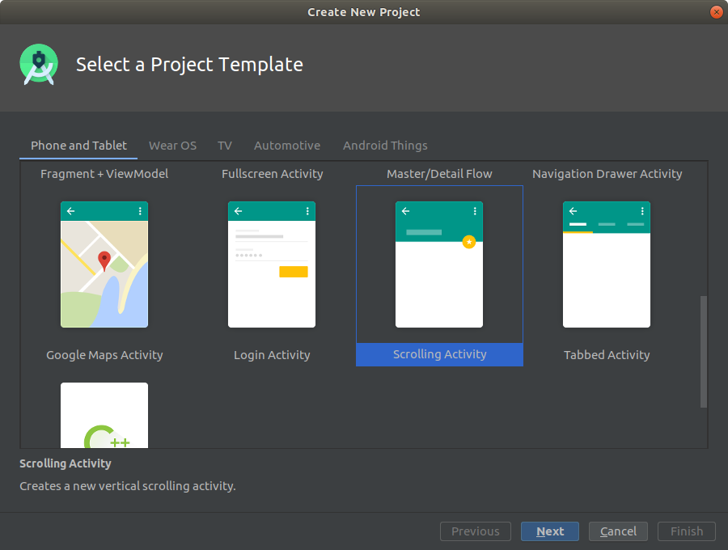
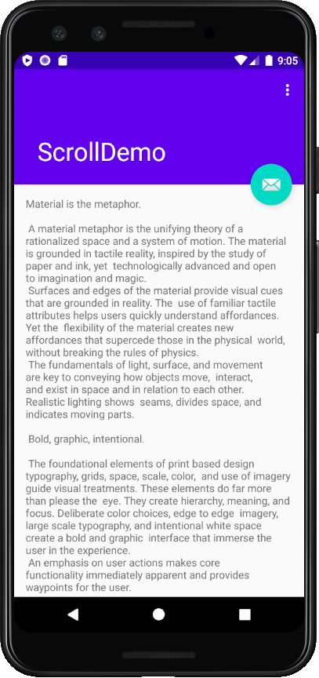
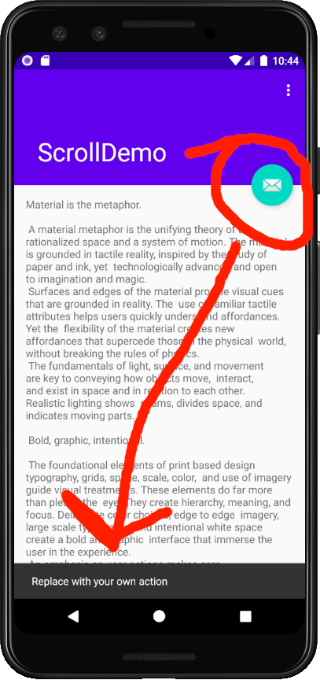

## CURSO BÁSICO DE DESENVOLVIMENTO COM ANDROID STUDIO E KOTLIN
### Navegação entre activities

[**Cleuton Sampaio**](https://github.com/cleuton)

[**O VÍDEO AINDA NÃO ESTÁ PRONTO**]

[**Assista ao vídeo desta lição ANTES de ler este conteúdo!**](****************************************)

Se você entrou aqui pela primeira vez, talvez seja melhor ver as [**lições do curso**](../README.md)

## Interação

Raramente uma aplicação móvel tem apenas uma única UI ou activity. Embora, com o conceito de [**Fragments**](https://developer.android.com/guide/components/fragments) que permitem criar aplicações compostas por fragmentos separados e uma única activity. É similar ao conceito de [**SPA - Single Page Application**](https://pt.wikipedia.org/wiki/Aplicativo_de_p%C3%A1gina_%C3%BAnica) de aplicativos web.

Aqui, mostrarei como navegar entre activities diferentes, que serve para criarmos apps mais responsivas e funcionais.

Outra coisa que falarei bem superficialmente é o [**Material Design**](https://material.io/develop/android/) que é um guia de construção de UI / UX da Google.

## Material Design

Material Design é um padrão arquitetural de projeto de interfaces de usuário, originalmente criada pela Google. Há uma [**descrição do que é Material Design**](https://material.io/design/introduction) de onde eu extrai esse trecho: 

> Material is an adaptable system of guidelines, components, and tools that support the best practices of user interface design. Backed by open-source code, Material streamlines collaboration between designers and developers, and helps teams quickly build beautiful products.

> O Material Design é um sistema adaptável de guias, componentes e ferramentas, que suportam as melhores práticas de projeto de interface de usuário. Suportado por código open-source, o Material Design aumenta a colaboração entre projetistas de interface e desenvolvedores, além de ajudar as equipes a criar rapidamente belos produtos.

Especificamente para Android, temos o [**Material Components for Android (MDC)**](https://material.io/develop/android/docs/getting-started/), com um novo namespace: **androidx**, que substitui a antiga Design Support Library. É um conjunto de componentes e especificações para suportar Material Design no ambiente Android.

Não é objetivo deste curso explicar em detalhes os conceitos de Material Design, portanto, vamos seguir uma linha incremental, apresentando os conceitos quando for necessário. 

A ideia é lhe dar rapidamente a capacidade para desenvolver aplicações móveis com Android Studio e Kotlin, e não explicar detalhes e características avançadas. 

## Uma aplicação de "Scrolling"

Muitas aplicações móveis são apenas visualizadores de conteúdo remoto, proveniente da **nuvem**. Um exemplo seria uma aplicação que apresenta artigos ou notícias. 

Essas aplicações apresentam uma lista ou um texto que pode ser navegado para cima ou para baixo, e, em alguns casos, é possível tocar para obter mais detalhes ou executar uma ação. 

Nessa altura do curso, você já deve saber criar uma aplicação, ainda mais se usar uma activity gerada pelo assistente, não? Bom, crie um novo projeto usando o modelo **Scrolling Activity**:



Excute a aplicação e veja como o scroll funciona: faça um drag com o mouse para cima ou para baixo (clique e arraste).



## Código da activity

Este tipo de activity tem uma **ToolBar**, contendo um menu, acionado pelo botão com 3 pontos verticais. Este botão invoca um menu, ao qual podemos adicionar ações. 

A activity usa um layout [**CoordinatorLayout**](https://developer.android.com/jetpack/androidx/releases/coordinatorlayout?hl=pt-br) com um layout [**AppBarLayout**](https://developer.android.com/reference/com/google/android/material/appbar/AppBarLayout) embutido nele. 

O layout **AppBarLayout** suporta muitos componentes MDC (**Material Design Components**) e funcionalidades como conteúdo rolável (scrolling). 

Temos uma toolbar, com um menu e um conteúdo rolável. Vamos examinar o código-fonte da activity (veja o nome que você deu): 

```
package com.obomprogramador.scrolldemo

import android.os.Bundle
import com.google.android.material.snackbar.Snackbar
import androidx.appcompat.app.AppCompatActivity
import android.view.Menu
import android.view.MenuItem
import kotlinx.android.synthetic.main.activity_scrolling.*

class ScrollingActivity : AppCompatActivity() {

    override fun onCreate(savedInstanceState: Bundle?) {
        super.onCreate(savedInstanceState)
        setContentView(R.layout.activity_scrolling)
        setSupportActionBar(toolbar)
        fab.setOnClickListener { view ->
            Snackbar.make(view, "Replace with your own action", Snackbar.LENGTH_LONG)
                    .setAction("Action", null).show()
        }
    }

    override fun onCreateOptionsMenu(menu: Menu): Boolean {
        // Inflate the menu; this adds items to the action bar if it is present.
        menuInflater.inflate(R.menu.menu_scrolling, menu)
        return true
    }

    override fun onOptionsItemSelected(item: MenuItem): Boolean {
        // Handle action bar item clicks here. The action bar will
        // automatically handle clicks on the Home/Up button, so long
        // as you specify a parent activity in AndroidManifest.xml.

        return when (item.itemId) {
            R.id.action_settings -> true
            else -> super.onOptionsItemSelected(item)
        }
    }
}
```

Temos 3 tratamentos de eventos aqui: 
- **onCreate**: Você já conhece. É invocado quando a Activity é instanciada;
- **onCreateOptionsMenu**: Serve para configurarmos os itens de um menu. É chamado apenas uma única vez;
- **onOptionsItemSelected**: Invocado sempre que uma opção do menu é selecionada.

Se observarmos a aplicação no emulador, e tocarmos no botão 3-pontos, veremos um item de menu chamado: "Settings", que nada faz. 

Como a aplicação tem um menu, é preciso montar o layout do menu dentro da aplicação. Isso é feito no **calback** (tratador de eventos) **onCreateOptionsMenu**. Usamos uma instância de **menuInflater** (já providenciada para nós) e "inflamos" o layout do menu. Como ele sabe qual é o layout do menu?

É hora de falarmos sobre o **R**... Em toda app Android você verá essa classe **R** sendo invocada. Ela é o **namespace** de todos os recursos da aplicação, como: layouts, ids, strings e imagens. No callback identificamos o menu assim: 
```
menuInflater.inflate(R.menu.menu_scrolling, menu)
```

O **id** do nosso menu, que fica em "src/main/res/menu/menu_scrolling.xml", é exatamente "menu_scrolling". Assim, ele sabe quais itens de menu fazem parte. Vejamos o arquivo XML: 
```
<menu xmlns:android="http://schemas.android.com/apk/res/android"
    xmlns:app="http://schemas.android.com/apk/res-auto"
    xmlns:tools="http://schemas.android.com/tools"
    tools:context="com.obomprogramador.scrolldemo.ScrollingActivity">
    <item
        android:id="@+id/action_settings"
        android:orderInCategory="100"
        android:title="@string/action_settings"
        app:showAsAction="never" />
</menu>
```

Temos um único item de menu, cujo **id** é "action_settings". Mas, qual é o texto que aparece no menu? É "Settings", certo? A propriedade **android:title** aponta para um **string**, criado dentro de um arquivo XML: "src/main/res/values/strings.xml". Lá dentro temos a entrada: 
```
<string name="action_settings">Settings</string>
```

Assim, se quisermos alterar o título do menu, não precisaremos alterar código Kotlin, bastando mudar o XML. Podemos fazer isso com qualquer string que utilizemos na aplicação, como o próprio título dela e o texto que está sendo apresentado no conteúdo principal.

O callback **onCreate**, além de informar qual é o layout da activity, também está criando uma expressão **lambda** para servir como **action listener**. O que é isso? Ao executar a app, notou um botão com uma carta na toolbar? Se clicar nele, aparece uma barra inferior com o texto: "Replace with your own action": 



O trecho que faz isso é este: 
```
        fab.setOnClickListener { view ->
            Snackbar.make(view, "Replace with your own action", Snackbar.LENGTH_LONG)
                    .setAction("Action", null).show()
        }
```

O que é **fab**? Se abrirmos o layout da nossa activity "src/main/res/layout/activity_scrolling.xml", vemos a declaração do botão com id **fab**: 
```
    <com.google.android.material.floatingactionbutton.FloatingActionButton
        android:id="@+id/fab"
        android:layout_width="wrap_content"
        android:layout_height="wrap_content"
        android:layout_margin="@dimen/fab_margin"
        app:layout_anchor="@id/app_bar"
        app:layout_anchorGravity="bottom|end"
        app:srcCompat="@android:drawable/ic_dialog_email" />
```

**Nota**: O Android nomeia o arquivo XML pegando o primeiro nome da sua activity e colocando um prefixo. Note que ele criou 2 arquivos XML: Um para a activity e outro para o seu conteúdo principal.

Bom, você já sabe o que é **onClickListener**. Aqui, ele está criando uma expressão lambda. A primeira coisa antes da seta é **view** o nome do argumento para a função lambda. Nessa Lambda, estamos instanciando um componente **Snackbar** (similar ao **Toast**) que faz parte do **Material Design**. Ele exibe uma mensagem de curta duração na parte inferior da Activity. 

Agora só falta falar do **onOptionsItemSelected**, que é invocado sempre que um item do menu for tocado. Nele, podemos fazer duas coisas: Tratar o evento ou delegar para outra função. Se tratarmos o evento, retornamos **true**, caso contrário, retornamos **false**. Neste caso, ele apenas testa se o item de menu foi o **Settings**, usando a classe **R** e o **id** do item de menu "action_settings", que já mostrei anteriormente: 
```
    override fun onOptionsItemSelected(item: MenuItem): Boolean {
        // Handle action bar item clicks here. The action bar will
        // automatically handle clicks on the Home/Up button, so long
        // as you specify a parent activity in AndroidManifest.xml.

        return when (item.itemId) {
            R.id.action_settings -> true
            else -> super.onOptionsItemSelected(item)
        }
    }
```

Em Kotlin o comando **when** é muito utilizado. Em linhas gerais, ele funciona como o **switch** do Java, mas há diferenças: 
- Não é necessário usar **break** a cada opção;
- Serve para testar qualquer tipo de expressão;
- Pode ser usado sem variável, como se fosse um ninho de **if**.

Neste caso, ele compara o valor de **item.itemId**, ou seja o **id** do item de menu clicado, que é parâmetro do **callback**, com o valor **R.id.action_settings**, que é o **id** do item **Settings**. Se for, então retorna **true**. Caso contrário, passa para a classe ancestral tratar. Se quiséssemos fazer alguma coisa, bastaria substituir o **true** por um bloco de comandos, por exemplo: 
```
        return when (item.itemId) {
            R.id.action_settings -> {
                Snackbar.make(app_bar,
                        "Você tocou em Settings!",Snackbar.LENGTH_LONG).show()
                return true
            }
            else -> super.onOptionsItemSelected(item)
        }
```

Neste exemplo, eu usei um bloco de comandos Kotlin, mostrei um **Snackbar**, dentro do componente principal da tela **app_bar**, e retorno **true**. Quando não usei bloco de comandos, não usei o **return**, mas apenas o valor **true**. 

Eu importei o **sintético** do layout: 
```
import kotlinx.android.synthetic.main.activity_scrolling.*
```

Isto faz com que cada elemento do layout, que tenha a propriedade **android:id** se transforma em uma variável que pode ser utilizada dentro de qualquer método da Activity. Nós usamos isso na lição passada.

## De onde ele pega o conteúdo rolável?

Boa pergunta! Em uma app real, isso viria através de um request na nuvem, como um servidor REST. Mas aqui, está dentro do strings.xml: 
```
<resources>
    <string name="app_name">ScrollDemo</string>
    <string name="large_text">
        "Material is the metaphor.\n\n"

        "A material metaphor is the unifying theory of a rationalized space and a system of motion."
        "The material is grounded in tactile reality, inspired by the study of paper and ink, yet "
        "technologically advanced and open to imagination and magic.\n"
        "Surfaces and edges of the material provide visual cues that are grounded in reality. The "
        "use of familiar tactile attributes helps users quickly understand affordances. Yet the "
        "flexibility of the material creates new affordances that supercede those in the physical "
        "world, without breaking the rules of physics.\n"
        "The fundamentals of light, surface, and movement are key to conveying how objects move, "
        "interact, and exist in space and in relation to each other. Realistic lighting shows "
        "seams, divides space, and indicates moving parts.\n\n"
```

Tem um **string** cmanado **large_text** que é usado na TextView declarada no arquivo "src/main/res/layout/content_scrolling.xml", que é inserido no activity_scrolling.xml. Dentro do content_scrolling.xml, o NestedScrollView aponta para: 
```
tools:showIn="@layout/activity_scrolling">
```


