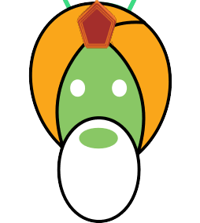
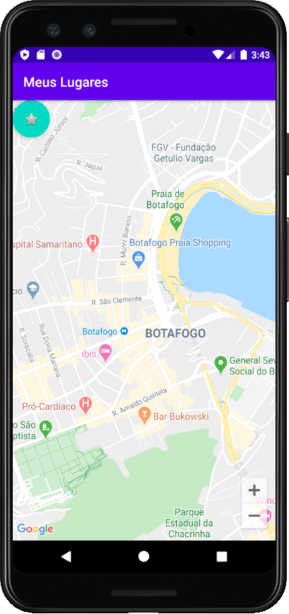

## CURSO BÁSICO DE DESENVOLVIMENTO COM ANDROID STUDIO E KOTLIN
### Mapas e persistência

[**Cleuton Sampaio**](https://github.com/cleuton)

[**Assista ao vídeo desta lição ANTES de ler este conteúdo!**](https://youtu.be/88TAkWtaxas)

Se você entrou aqui pela primeira vez, talvez seja melhor ver as [**lições do curso**](../README.md)

Já fizemos muita coisa, porém, faltou aquela sensação de **app de verdade** não? O que está faltando? Uma app de verdade faz algumas coisas que ainda não mostramos: 
- Consome serviços em nuvem;
- Persiste escolhas do usuário;

Então, vou falar de 2 coisas bem legais: Persistência e Consumo de serviços em nuvem, e vou fazer isso com uma coisa bem legal: Mapas!


A app será bem simples, ao entrar, ela posiciona o mapa em um local arbitrário. Você pode fazer zoom no mapa, tocar para saber o endereço das ruas e pode adicionar locais preferidos, com um toque longo. Ao tocar no botão flutuante, você verá o menu dos logais preferidos salvos e poderá visualizá-los tocando neles.

Em Android (e mobile em geral) há diferenças entre toque curto e longo!

## Persistência em apps

Embora você possa criar arquivos e até bancos de dados (SQLite) em um dispositivo Android, isso não faz o menor sentido! 

*Por que?* Pense bem... Um dispositivo móvel é algo volátil: Hoje você tem um, amanhã pode ter outro. E há pessoas, como eu, que usam mais de um dispositivo móvel (um ou dois smartphones e um tablet). Como ficam os dados que eu criei nas aplicações?

**Ubiquidade** 

Vamos supor que você tenha uma app muito legal, que permite a você criar coisas bem interessantes. Por exemplo, uma app que crie um log de sua viagem, incluindo imagem e dados georreferenciados, por exemplo. Você a criou em seu smartphone. O autor da app criou um banco de dados SQLite com tudo o que você criou. 

Parece legal, não? Mas... 
a) E se você perder o smartphone?
b) E se a bateria acabar e você quiser mostrar uma viagem a um amigo?
c) E se você quiser compartilhar a viagem com alguém?

Os dados dessa app hipotética carecem de **ubiquidade**! Eles existem apenas em um smartphone! O ideal é que esses dados sejam persistidos em nuvem. 

Portanto, criar arquivos ou bancos de dados sofisticados em um smartphone, fere o conceito de ubiquidade dos dados. 

Uma app de smartphone pode e deve armazenar algumas coisas localmente, mas o ideal é que sempre sejam um espelho do que está na nuvem. A nuvem é onde os dados moram! Os dados locais são apenas **cache**.

Nesta app, vou usar um mecanismo bem interessante chamado [**SharedPreferences**](https://developer.android.com/reference/android/content/SharedPreferences) que me permite armazenar dados primitivos e strings dentro da aplicação, no dispositivo móvel. 

Embora seja um mecanismo simples, com poucas opções, é rápido e eficaz, ou seja, exatamente o que precisamos para armazenar alguns dados localmente. 

## Interfaces móveis

As últimas apps que fizemos, embora úteis para aprendizado, vão contra a [**Princípios de UX**](http://uxbert.com/10-mobile-ux-design-principles/#.XrmGpHVKg5k) de aplicações móveis. 

Coisas que você deve evitar em uma app: 

a) **Esconder informação**: Cara, informação que exige mais de 3 toques para acessar, está **escondida** e vai irritar ao usuário; 
b) **Leitura**: Quanto mais o usuário necessitar ler coisas para obter o que deseja, mais frustrado ficará. Símbolos e gestos são mais importantes. Ele só deve ler aquilo que solicitou, como uma reportagem, por exemplo. UI com muitos cabeçalhos e mensagens são irritantes;
c) **Digitação**: Tenho visto apps que mostram forms para os usuários. Nada é mais irritante do que isso! Mesmo que seja para **login**! Use redes sociais para **login**, e procure ordenar os conteúdos, para que ele nada tenha que digitar ou buscar;
d) **Controles**: Radio buttons, checkboxes e slidebars pertencem às **Configurações** de preferências, e devem existir apenas na tela de configuração da app;

A interface da app deve ser fluidica e baseada em gestos comuns, como: toque, toque demorado, toque duplo, deslizar, movimento de pinça etc. E, preferencialmente, evitar gestos que usem mais do que o polegar (pinça usa dois dedos).

Nesta aplicação, vou começar a introduzir alguns desses conceitos. 

## Serviços Google

Vamos usar o serviço do **GoogleMaps** em nossa app, que é totalmente gratuito para aplicações Android. Também será necessário fazer uma geocodificação reversa, ou seja, dadas a latitude e longitude, obter o endereço do local. Para isso, vou usar a classe **Geocoder** do Android, cujo uso também é gratuito. 

Veja bem: O uso de mapas em dispositivos Android (classe **GoogleMap**) e o uso da classe **Geocoder** são gratuitos (por enquanto). O uso da API de Mapas ou da API de Geocodificação do Google Mapas, que são mais precisas, são pagas!

## Criação da app base

Crie um novo projeto e selecione o template **Google Maps Activity**: 


Você ainda não pode executar a aplicação, pois necessita de uma **Chave de API** para isto. Abra o arquivo que está em "res/values/google_maps_api.xml": 
```
<resources>
    <!--
    TODO: Before you run your application, you need a Google Maps API key.

    To get one, follow this link, follow the directions and press "Create" at the end:

    https://console.developers.google.com/flows/enableapi?apiid=maps_android_backend&keyType=CLIENT_SIDE_ANDROID&r=F3:38:74:E7:57:78:9F:B1:E0:3F:35:77:51:74:AB:85:AD:CD:1C:F3%3Bcom.obomprogramador.meuslugares

    You can also add your credentials to an existing key, using these values:

    Package name:
    com.obomprogramador.meuslugares

    SHA-1 certificate fingerprint:
    F3:38:74:E7:57:78:9F:B1:E0:3F:35:77:51:74:AB:85:AD:CD:1C:F3

    Alternatively, follow the directions here:
    https://developers.google.com/maps/documentation/android/start#get-key

    Once you have your key (it starts with "AIza"), replace the "google_maps_key"
    string in this file.
    -->
    <string name="google_maps_key" templateMergeStrategy="preserve" translatable="false">YOUR_KEY_HERE</string>
</resources>
```

Você precisará criar um projeto na **Console do Desenvolvedor Google**, com o nome do pacote do seu projeto (ele já criou um link para isso no arquivo, é só fazer CTRL+Clique), e depois criar uma Chave de API: 


Você pode criar um novo projeto ou selecionar um já existente (caso já tenha usado os serviços Google).

Depois de criar um projeto, é necessário criar uma nova Chave de API: 


Finalmente, você precisa copiar e guardar a Chave de API: 


É a chave para Android que você criou. Em caso de dúvida, confira a data de criação.

Muito bem, substituia a Chave de API no arquivo "res/values/google_maps_api.xml" e execute a aplicação. 


Pronto! É só isso que ela faz: Coloca um marcador em Sidney, Austrália. Eis o código da Activity que faz isso: 
```
    override fun onMapReady(googleMap: GoogleMap) {
        mMap = googleMap

        // Add a marker in Sydney and move the camera
        val sydney = LatLng(-34.0, 151.0)
        mMap.addMarker(MarkerOptions().position(sydney).title("Marker in Sydney"))
        mMap.moveCamera(CameraUpdateFactory.newLatLng(sydney))
    }
```

Esta activity implementa a interface **OnMapReadyCallback** e recebe os callbacks de eventos do Mapa, através de um fragmento de mapa do seu layout. Quando o mapa está pronto para ser exibido, ela cria uma instância de LatLng (latitude e longitude), com as coordenadas de Sidney, adiciona um marcador no mapa com esta posição, e move a câmera para ele. 

O layout dessa aplicação pode ser visto no código: 
```
setContentView(R.layout.activity_maps)
        // Obtain the SupportMapFragment and get notified when the map is ready to be used.
        val mapFragment = supportFragmentManager
                .findFragmentById(R.id.map) as SupportMapFragment
        mapFragment.getMapAsync(this)
```

Há um arquivo "res/layout/activity_maps.xml", com apenas 1 fragmento de layout: 
```
<?xml version="1.0" encoding="utf-8"?>
<fragment xmlns:android="http://schemas.android.com/apk/res/android"
    xmlns:map="http://schemas.android.com/apk/res-auto"
    xmlns:tools="http://schemas.android.com/tools"
    android:id="@+id/map"
    android:name="com.google.android.gms.maps.SupportMapFragment"
    android:layout_width="match_parent"
    android:layout_height="match_parent"
    tools:context=".MapsActivity" />
```

A classe **SupportMapFragment** (cast) tem o método getMapAsync(), que obtém o mapa e recebe os eventos.

## Dependências

Para criar minha app em cima desta, preciso acrescentar duas dependências ao projeto: 
- **play-services-location**
- **play-services-placereport**

Isso é para fazer a geocodificação reversa e obter o endereço de um local pelas suas coordenadas. Para isto, abra o menu: "File / Project Structure", selecione **Dependencies** no menu lateral esquerdo, e clique no botão **Add dependency**: 


Aparecerá um menu de contexto. Selecione **Library dependency** e pesquise "play-services-location": 


Faça a mesma coisa com **play-services-placereport**.

## Layout

Esse layout só com um fragmento não vai funcionar para a minha app. Eu preciso inserir um botão flutuante para o usuário ver a lista dos seus locais preferidos (que será obtida de SharedPreferences). Para isto, preciso criar um layout [**FrameLayout**](https://developer.android.com/reference/android/widget/FrameLayout) e inserir o fragmento e o botão nele. Abra o arquivo "res/layout/**activity_maps.xml**" e modifique para ficar assim: 
```

<?xml version="1.0" encoding="utf-8"?>
<FrameLayout xmlns:app="http://schemas.android.com/apk/res-auto"
    android:layout_width="match_parent"
    android:layout_height="match_parent"
    xmlns:android="http://schemas.android.com/apk/res/android"
    android:id="@+id/lmain">

    <com.google.android.material.floatingactionbutton.FloatingActionButton
        android:id="@+id/floatingActionButton"
        android:layout_width="wrap_content"
        android:layout_height="wrap_content"
        android:clickable="true"
        app:srcCompat="@android:drawable/btn_star" />

    <fragment xmlns:android="http://schemas.android.com/apk/res/android"
        xmlns:map="http://schemas.android.com/apk/res-auto"
        xmlns:tools="http://schemas.android.com/tools"
        android:id="@+id/map"
        android:name="com.google.android.gms.maps.SupportMapFragment"
        android:layout_width="match_parent"
        android:layout_height="match_parent"
        tools:context=".MapsActivity" />

</FrameLayout>
```

Eu informei um **id** para o FrameLayout mas não é necessário. Você também pode fazer isso pela interface, o que é mais fácil: 

1. Recorte o código do fragmento (cole em um gedit);
2. Arraste um **FrameLayout** para a activity;
3. Arraste um **FloatActionButton**;
4. Abra a visualização em XML e cole o fragmento que você copiou;

Eu usei um asterisco como ícone do botão, para indicar que são os locais favoritos do usuário. Você pode saber quais ícones existem no editor de layout, onde eu criei essa interface.

## Mudando o comportamento

A primeira coisa que eu quero é mudar a inicialização da aplicação. Ela vai abrir mostrando uma determinada coordenada do Rio de Janeiro. No arquivo "src/main/java/[pacote da app]/[nomeDaActivity.kt]" vamos mudar o callback de **onMapReady**: 
```
    override fun onMapReady(googleMap: GoogleMap) {
        mMap = googleMap
        val ui = mMap.uiSettings
        ui.isZoomControlsEnabled = true
        val geocoder = Geocoder(this)
        
        val botafogo = LatLng(-22.9504578,-43.1828463)

        var addressText = getAddress(botafogo)

        mMap.moveCamera(CameraUpdateFactory.newLatLng(botafogo))
        mMap.moveCamera(CameraUpdateFactory.zoomTo(15.0F))
```

Eu habilitei os botões de **zoom** para o usuário poder manipular melhor o mapa. Depois, criei uma instância de **Geocoder**, para obter os endereços a partir das coordenadas. 

Depois, eu criei uma instância de LatLng apontando para um local em **Botafogo**, no Rio de Janeiro, movi a câmera do mapa para lá, e dei um **zoom** de 15, que mostra o nível das ruas. É assim que a app vai aparecer:



Se você tocar no mapa (um toque normal), eu quero exibir o endereço de onde você tocou. Para isto, vou usar a classe **Geocoder**. Preciso criar um callback para o evento **onMapClickListener**:
```
        mMap.setOnMapClickListener { latlong ->
            Toast.makeText(this,getAddress(latlong),Toast.LENGTH_LONG).show()
        }
```

Este callback recebe uma instância de LatLng e eu criei uma lambda que recebe isso e usa um **Toast** para exibir o endereço. Quem transforma a LatLng em endereço é a função **getAddress**: 
```
    private fun getAddress(latLng: LatLng): String {
        val geocoder = Geocoder(this)
        val addresses: List<Address>?
        var addressText = ""

        try {
            addresses = geocoder.getFromLocation(latLng.latitude, latLng.longitude, 1)
            if (null != addresses && !addresses.isEmpty()) {
                addressText = addresses[0].getAddressLine(0)
            }
        } catch (e: IOException) {
            Log.e("MapsActivity", e.localizedMessage)
        }

        return addressText
```

Notou o tipo da lista de endereços? Ele tem uma interrogação, o que implica que é nulável. O método **getFromLocation** obtem um só endereço, correspondente à latitude e longitude. E eu pego apenas a primeira linha deste endereço (pode haver várias linhas). Também estou usando o **Log**, coisa que falarei em outra lição. 

## SharedPreferences

Esta é a melhor maneira de armazenar cópias de dados localmente. O ideal é armazenar na nuvem, por exemplo, no **Firebase** ou no **AWS DynamoDB** e guardar apenas a cópia no dispositivo. Mas, por enquanto, vamos armazenar apenas no dispositivo.

Uma SharedPreference é um item armazenado em um dicionário, dentro de um arquivo XML na aplicação. Se ele não existir, será criado. Este arquivo será criado no dispositivo móvel ou então dentro do seu AVD. Vamos ver a função **changePrefs** que cria uma nova entrada no arquivo: 
```
    fun changePrefs(endereco: String, latLng: LatLng) {
        val sharedPreference =  getSharedPreferences("meuslugares", Context.MODE_PRIVATE)
        var editor = sharedPreference.edit()
        var texto = "${latLng.latitude}:${latLng.longitude}"
        editor.putString(endereco,texto)
        editor.commit()
    }
```

Esta função recebe um endereço, que será a chave da preferência, e a instância de LatLng. Ele obtém (ou cria) o arquivo de SharedPreferences chamado **meuslugares**, cria um **editor** para ele, adiciona a preferência na forma de string, e executa o **commit()**, salvando tudo.

Eu transformo a latitude e longitude em um string, e adiciono com **putString**, informando o endereço como chave. 

**Onde isso fica gravado?**

Com o AVD em execução, abra o menu: "View / ToolWindows / Device File Explorer". Procure a pasta "data / data", e procure a pasta do pacote da aplicação. Depois a pasta **sharedPrefs**. Seu arquivo estará lá: 


Na figura podemos ver o **Device File Explorer**, à direita, e o arquivo XML editado à esquerda. Evite alterar o arquivo diretamente!

Eu armazenei as preferências tendo o endereço como chave e um string com a latitude e a longitude, separados por ":".

## Criação de um local favorito

Se o usuário fizer um toque longo, eu quero adicionar um marcador e salvar o local nas SharedPreferences. Isso é feito no callback do evento **setOnMapLongClickListener**: 
```
        mMap.setOnMapLongClickListener {
            val endereco = getAddress(it)
            mMap.addMarker(MarkerOptions().position(it).title(endereco))
            Toast.makeText(this,"Adicionando: ${endereco}",Toast.LENGTH_LONG).show()
            changePrefs(endereco,it)
        }
```

Aparentemente, é só um lambda. Como eu não informei a variável que recebe o argumento (que é um LatLng), posso usar a variável implícita **it** para me referenciar a ele. Ei adiciono um marcador no mapa, mostro um Toast com o endereço (obtido do **Geocoder**) e chamo a função **changePrefs** para adicionar o novo local favorito. 


## Menu de favoritos

Conforme você vai adicionando favoritos, eles serão gravados na SharedPreferences. Ao tocar no botão flutuante, quero mostrar um menu com a lista dos endereços. Se você tocar em um deles, o mapa se move para o local indicado. Isso é feito no callback **setOnClickListener** do botão flutuante. Lembre-se de ver o nome do botão flutuante no seu layout (android:id): 
```
        floatingActionButton.setOnClickListener {
            val lista = getPrefs()
            if ((lista?.size ?: 0) == 0) {
                Toast.makeText(this, "Não há preferidos ainda!", Toast.LENGTH_SHORT).show()
            }
            else {
                val menu = PopupMenu(this, floatingActionButton)
                if (lista != null) {
                    for (texto in lista) {
                        menu.menu.add(texto)
                        menu.setOnMenuItemClickListener {
                            val litens = it.title.split(":")
                            val posic = LatLng(litens[1].toDouble(),litens[2].toDouble())
                            mMap.addMarker(MarkerOptions().position(posic).title(litens[0]))
                            mMap.moveCamera(CameraUpdateFactory.newLatLng(posic))
                            mMap.moveCamera(CameraUpdateFactory.zoomTo(15.0F))
                            true
                        }
                    }
                }
                menu.show()
            }
        }
```

Eu criei uma função **getPrefs** que traz os endereços na forma de lista. Só que essa lista pode ser nula, ou seja, não ter sido criada! Vejamos a função **getPrefs**: 
```
    fun getPrefs() : List<String>? {
        val mapa = getSharedPreferences("meuslugares", Context.MODE_PRIVATE).all
        val saida = mutableListOf<String>()
        for (entrada in mapa) {
            saida.add("${entrada.key}:${entrada.value}")
        }
        return saida
    }
```

Eu declarei o retorno da função como **List<String>?** ou seja, poderia até retornar **null** dessa função! Eu uso o método **all** do objeto SharedPreferences, e obtenho um mapa com todos os elementos. Então, é só adicionar tudo na lista Eu transformo cada entrada em apenas um string, separando os elementos com ":".

Voltando ao callback, esse comando merece uma explicação: 
```
if ((lista?.size ?: 0) == 0) {
```

A lista pode ser nula, certo? Então, se ela for nula e eu tentar usar a propriedade **size**, tomarei um **NullPointerException**, certo? Colocando uma interrogação antes da propriedade, caso o objeto sena nulo, vai retornar apenas nulo, sem dar exception. Então, eu uso o operador **Elvis** ("?:") para retornar zero caso o lado esquerdo seja nulo. 

Se a lista tiver tamanho zero, eu mostro um toast, senão, eu monto um menu popup. 

Eu instanciei um **PopupMenu**, ancorando-o no botão flutuante: 
```
val menu = PopupMenu(this, floatingActionButton)
```

Para cada local na lista, eu preciso dividir baseado em ":", assim obtenho um vetor de strings. Eu adiciono o texto do menu (primeira posição), e adiciono um callback **setOnMenuItemClickListener** para cada item do menu, colocando um marcador na posição e fazendo a câmera do mapa mover para lá. 

Se você tocar em um local do menu, a câmera do mapa se moverá para ele e um marcador aparerá: 


## Exercício

Tente fazer esse projeto! Você vai aprender muita coisa. Se **jogar a toalha** não se preocupe! Eu zipei e coloquei uma versão no repositório. Você só vai precisar informar sua Chave de API Google para rodar. 

Mas estude e tente fazer! Não é difícil!

O zip do projeto completo está aqui, no repositório, na pasta desta lição. Você precisará editar o arquivo de recurso chamado **google_maps_api.xml** dentro de "src/main/res/values" com este conteúdo: 
```
<resources>
    <!--
    TODO: Before you run your application, you need a Google Maps API key.

    To get one, follow this link, follow the directions and press "Create" at the end:

    https://console.developers.google.com/flows/enableapi?apiid=maps_android_backend&keyType=CLIENT_SIDE_ANDROID&r=F3:38:74:E7:57:78:9F:B1:E0:3F:35:77:51:74:AB:85:AD:CD:1C:F3%3Bcom.obomprogramador.meuslugares

    You can also add your credentials to an existing key, using these values:

    Package name:
    com.obomprogramador.meuslugares

    SHA-1 certificate fingerprint:
    F3:38:74:E7:57:78:9F:B1:E0:3F:35:77:51:74:AB:85:AD:CD:1C:F3

    Alternatively, follow the directions here:
    https://developers.google.com/maps/documentation/android/start#get-key

    Once you have your key (it starts with "AIza"), replace the "google_maps_key"
    string in this file.
    -->
    <string name="google_maps_key" templateMergeStrategy="preserve" translatable="false">YOUR_KEY_HERE</string>
</resources>
```

E terá que obter sua Chave de API e substituir o texto **YOUR_KEY_HERE** por ela. 


