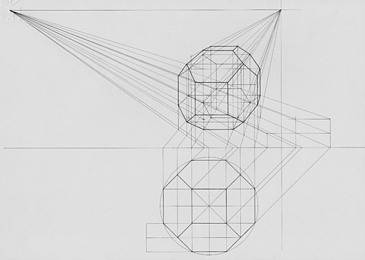

# Renderização OpenGL com Kotlin

[**Cleuton Sampaio**](https://github.com/cleuton)

## Criando uma app sinistra


Então, no meio da reunião, você larga um **petardo** como essa app ai, detonando totalmente os *conversinhas-fiadas* e *baba-ovos*! Que tal?

Cara, as vezes temos que ser como Romário, na copa de 94, e desequilibrar o jogo!

E o **OpenGL** pode ser a chave para você conseguir fazer isso. Vamos começar com **OpenGL** e depois vamos para a nova API: **Vulkan**! Mas uma coisa de cada vez. 

Você pode criar simulações, games e interfaces em 3D, com efeitos sensacionais e eu vou te ensinar os fundamentos do uso e renderização de imagens com OpenGL e Kotlin. 

Neste primeiro tutorial, vou mostrar que **berimbau não é gaita**! Todo tutorial de OpenGL mostra essa panaquice ai: 


Um **triângulo**! Pô! Até parece que você vai se lascar todo (OpenGL é difícil e complexa) só para desenhar uma porcaria de triângulo que serve para nada! Se precisa desenhar um triângulo, use os métodos normais de desenho, ou então uma figura de triângulo e pronto!

Esse primeiro **hello-world** vai ser *do mal*! Vamos começar arrebentando mesmo. Mas lembre-se: 

>OpenGL não é para os fracos!

OpenGL é complexa, difícil e muito, mas muito detalhada mesmo. Mas então, qual é a vantagem?

1. Torna a app mais rápida, pois a renderização é feita pela **GPU**;
2. Já é preparada para renderizar em **3D**;

Caso contrário, você teria que renderizar seus gráficos utilizando a mesma **CPU** que usa para processar sua aplicação, o que diminui a performance. Em games e simulações 3D, é essencial deixar esse trabalho com a GPU, enquanto a CPU vai gerando os **frames** a serem exibidos, tentando conseguir um alto **frame rate**.

>Frame é a imagem que está sendo exibida em determinado momento. Contém o cenário e os objetos do game ou simulação. Frame rate é a taxa de frames exibidos por segundo. Quanto maior, mais suave a visualização

## O que é e como funciona a OpenGL

Sabe o que é uma **GPU**? Uma GPU é um processador paralelo muito poderoso, voltado para geração de imagens. Seu smartphone tem uma gpu. Por exemplo, um Samsung A70 tem uma GPU **Qualcomm Adreno 612** que tem performance razoável com games. 

Você informa à GPU o que quer renderizar e ela utiliza uma programação especial para fazer isso, em paralelo com a CPU, ou seja, enquanto a GPU renderiza um frame, você gera outro!

[**OpenGL**](https://www.opengl.org/) é um padrão de interface para GPUs, criado pelo [**Khronos Group**](https://www.khronos.org/) um consórcio aberto de 150 empresas, voltado a criar mecanismos livres de royalties para aceleração computacional e gráfica. Assim como a [**Vulkan**](https://www.khronos.org/vulkan/) a nova API gráfica. 

A OpenGL permite que você envie dados e código-fonte para serem processados pela GPU. Os dados podem ser: 
- Coordenadas
- Cores
- Normais
- Índices

E o código-fonte é formado pelos [**Shaders**](https://www.khronos.org/opengl/wiki/Shader), escritos em linguagem [**GLSL**](https://www.khronos.org/opengl/wiki/OpenGL_Shading_Language), que programam a GPU para renderizar vértices e fragmentos entre eles. 

A versão do OpenGL que temos em dispositivos **Android** é a [**OpenGL ES**](https://www.khronos.org/opengles/) (para Embedded Systems). 

## Uma aplicação OpenGL

Antes de mais nada, o projeto desta aplicação está zipado na mesma pasta arquivo: [**GLplaySphere.zip**](./GLplaySphere.zip). Basta descompactar e importar para o **Android Studio**.

Uma app GLES (OpenGL ES) usa uma [**GLSurfaceView**](https://developer.android.com/reference/android/opengl/GLSurfaceView), em vez de uma **Activity** convencional, em XML. 

Abra o projeto e localize o arquivo **GLview.kt**, que é a minha implementação dessa classe. Começamos assim: 
```
class MainView(context: Context,
               elements: List<Element>) : GLSurfaceView(context) {
```

Eu criei um construtor primário que recebe o **Contexto** (android.content.Context) e uma lista de elementos a serem desenhados. A classe **Element** é um wapper que eu criei para que possa incluir vários tipos de elementos diferentes: 
```
open class Element {
    open fun draw(program: Int,
                  projectionMatrix: FloatArray,
                  modelViewMatrix: FloatArray,
                  normalMatrix: FloatArray
                    ) {}
}
```

Seu construtor recebe o **handler** (um indicador dentro da GPU) do **programa GLSL compilado** (inclui o código fonte dos shaders) e 3 matrizes. Sim, matrizes mesmo: 
- [**projectionMatrix**](http://www.songho.ca/opengl/gl_projectionmatrix.html): Matriz de projeção. Transforma as coordenadas tridimensionais projetando-as em um plano bidimensional;
- [**modelViewMatrix**](http://www.songho.ca/opengl/gl_transform.html):É a combinação do ponto de vista (View Matrix) com as transformações do modelo (Model Matrix);
- [**normalMatrix**](): A matriz que preserva os [**normais dos vértices da imagem**](https://learnopengl.com/Advanced-Lighting/Normal-Mapping); 

Todas as [**transformações 3D**](https://medium.com/swlh/understanding-3d-matrix-transforms-with-pixijs-c76da3f8bd8) são realizadas através de matrizes. 

Um objeto 3D pode sofrer transformações, como: 
- **Translação**: Cada vértice da figura é movido n unidades em uma determinada direção; 
- **Rotação**: Os vértices são rotacionados em relação a um dos eixos (x, y, z);
- **Escala**: Os vértices são posicionados para aumentar o objeto em relação aos 3 eixos;

Essas transformações são representadas na matriz a ser aplicada ao modelo, conhecida como **Model Matrix**.

A origem de um gráfico 3D é geralmente no centro. O eixo **x** é horizontal, o **y**, vertical, e o **z** a distância perpendicular ao cruzamento dos eixos x e y. É a distância da cena.  

Mas temos que considerar como a cena está sendo observada. Em alguns softwares 3D, esse conceito é representado pela [**câmera**](https://learnopengl.com/Getting-started/Camera). Há vários parâmetros a serem considerados, como: 
- **Posição**: A posição da câmera com relação à origem;
- **Direção**: Para onde a câmera está apontando;
- **Cima**: O vetor que aponta para o lado de cima da cena;

Geralmente, a câmera fica no eixo z, olhando para o centro, como na imagem: 


Geramos uma matriz de visão utilizando a função [**lookAt**]() do OpenGL, que precisa dos parâmetros da "camera" e gera um matriz de visão. 

Multiplicamos a matriz do modelo pela matriz de visão e obtemos a **Model View Matrix**. 

Falta explicar a matriz de projeção... Como vamos renderizar uma imagem 3D em uma tela 2D?


Uma das projeções possíveis é a [**perspectiva**](https://en.wikipedia.org/wiki/Perspective_(graphical)) que distorce a imagem 2D diminuindo as imagens (ou partes delas) que estão mais distantes do observador. 



Para usar uma projeção perspectiva, criamos uma matriz de projeção. Para isto, usamos os parâmetros:
- **fovy**: Field of View - y ou campo de visão no eixo y, o ângulo de visão vertical;
- **aspecto**: Aspecto da tela (largura / altura);
- **near**: Plano que determina o limite mais próximo do objeto. Tudo que estiver antes do **near** não será exibido;
- **far**: Plano que determina o limite mais distante do objeto. Tudo que estiver depois do **far** não será exibido;

O parâmetro **aspecto** é fácil de entender, mas os outros, nem tanto. Essa figura ajuda: 


Um vetor normal de um vértice indica a direção onde o vértice está orientado, e isso implica na reflectância da luz incidente. A matriz de normais é a matriz transposta da inversa da modelViewMatrix, e serve para preservar os vetores normais dos vértices da imagem.


Isso vai ficar mais claro em um exemplo posterior, no qual eu aplicarei uma textura e a reflectância ficará mais aparente. 

Nós devemos desenhar um objeto considerando que o centro está na origem dos pontos, e usar a **translação** e **rotação** para posicioná-lo onde queremos na tela. 

Para que nossa aplicação funcione, além dessas matrizes todas, precisamos de dois programas GLSL: 
- [**vertex shader**](https://pt.wikipedia.org/wiki/Vertex_shader): Processa cada vértice da imagem, aplicando as transformações necessárias;
- [**fragment shader**](https://www.khronos.org/opengl/wiki/Fragment_Shader): Processa e interpola cada fragmento da imagem entre os vértices;

O código fonte dos shaders pode variar um pouco, dependendo dos efeitos que você quer dar ao seu gráfico. Por exemplo, vou mostrar dois shaders bem simples: 

**Vertex Shader simples:**
```
attribute vec4 vPosition;
void main() {
    gl_Position = vPosition;
}       
```

Ele tem um atributo **vPosition** que é preenchido com cada vértice da nossa imagem. para isso, é preciso enviar nosso vetor de vértices para a GPU e associá-lo a este atributo.

Vejamos agora este: 

**Fragment Shader simples:**
```
precision mediump float;
uniform vec4 vColor;
void main() {
    gl_FragColor = vColor;
}
```

Aqui, não temos um parâmetro, mas um argumento **uniform**, que não varia entre chamadas do shader, e, neste caso, são as cores para renderizar os fragmentos. 

## Classes do framework


### Activity

Para criar uma app OpenGL no Android Studio usando Kotlin, crie uma app sem activity alguma. Depois, acrescente um arquivo Kotlin com a sua activity principal:
```
package com.obomprogramador.glplaysphere

import android.app.Activity
import android.opengl.GLSurfaceView
import android.os.Bundle

class GlActivity : Activity() {

    private lateinit var gLView: GLSurfaceView
    private val elements = mutableListOf<Element>()

    public override fun onCreate(savedInstanceState: Bundle?) {
        super.onCreate(savedInstanceState)

        val esfera = Sphere(intArrayOf(1, 0, 0, 1),2)
        esfera.generate()
        elements.add(esfera)
        gLView = MainView(this, elements)

        setContentView(gLView)
    }
}
```

Note que não há layout XML a ser inflado! 

Criei uma instância da classe **Sphere**, que recebe em seu construtor um vetor de cor e um raio. As cores tem 4 elementos: R (vermelho), G (verde), B (azul) e alfa (transparência). Essa esfera será vermelha com raio 2. Falaremos mais sobre essa classe depois. 

O método **generate** gera a esfera, calculando as posições dos triângulos que formam a esfera, os normais e os índices dos vértices (o que precisa ser renderizado primeiro).

Então, instancio a **MainView** passando os elementos (objetos gráficos que eu quero desenhar). 

O **setContentView** recebe a instância de **MainView**. Mas o que é essa classe?

## GLsurfaceView

Veja o arquivo **GLview.kt** no projeto zipado. Vou mostrar aqui apenas alguns trechos de código. 

A classe **MainView** é derivada de **GLsurfaceView**. Nela, além de definir o código dos shaders, eu inicio um **renderer**, que é uma classe derivada de GLsurfaceView.Renderer. 

Vejamos o código do **vertex shader**: 
```
attribute vec3 aVertexPosition;
attribute vec4 aVertexColor;
attribute vec4 aVertexNormal;
uniform mat4 uMVMatrix;
uniform mat4 uPMatrix;
uniform mat4 uNormalMatrix;

varying lowp vec4 vColor;

void main(void) {

    highp vec3 uLightColor = vec3(0.95, 0.97, 0.51);
    highp vec3 uLightDirection = vec3(0.5, 0.99, 0.99);
    highp vec3 ambientColor = vec3(0.4, 0.4, 0.4);

    gl_Position = uPMatrix * uMVMatrix * vec4(aVertexPosition, 1.0);
    vec4 xnormal = uNormalMatrix * aVertexNormal;
    float dotNormal = max(dot(uLightDirection, normalize(xnormal.xyz)), 0.0);
    vec3 ambient = ambientColor * aVertexColor.rgb;
    vColor = vec4((aVertexColor.xyz * dotNormal) + ambient , aVertexColor.a);;
}   
```

Ele é informado como um string, para que não dê conflito com o Kotlin. Ele recebe 3 atributos e 3 uniforms: 
- **aVertexPosition**: Posição de um vértice com 3 coordenadas;
- **aVertexColor**: Cor de um vértice com 4 elementos (RGBA);
- **aVertexNormal**:  As coordenadas do vetor normal de um vértice;
- **uMVMatrix**: A modelViewMatrix, que eu já expliquei, uma matrix 4x4;
- **uPMatrix**: A projectionMatrix, que eu já expliquei, uma matrix também 4x4;
- **uNormalMatrix**: A matriz de normais, que eu já expliquei, também 4x4;

Ele usa essas matrizes para calcular a cor do vértice **vColor** que é compartilhada com o Fragment Shader. Note que eu informo os elementos sobre a luz: Cor da luz, direção da luz e luz difusa (ambiente).

Agora, vejamos o código do Fragment Shader: 
```
precision mediump float;
varying lowp vec4 vColor;
void main(void) {
    gl_FragColor = vColor;
}
```

Ele simplesmente obtém a cor calculada pelo Vertex Shader e a utiliza no fragmento. Não temos textura aqui, portanto tudo é mais simples. 

## GLSurfaceview.Renderer

É aqui que as coisas acontecem! Abra o arquivo **GLrenderer.kt** no projeto zipado e acompanhe. 

O Renderer tem alguns callbacks importantes: 
- **onSurfaceCreated**: Invocado quando a GLSurfaceView é criada;
- **onDrawFrame**: Invocado quando é necessário desenhar um frame;
- **onSurfaceChanged**: Invocado quando o tamanho ou a proporção da tela são alterados. Por exemplo, se você inclinar o smartphone para landscape ou vice-versa;

Se você observar o código fonte, verá o que estou fazendo em cada um desses callbacks. 

### onSurfaceCreated

Eu envio os dois shaders, compilo formando um só programa GLSL e obtenho o **handler** dele na variável **program**. Eu usarei o programa compilado para renderizar todas as minhas imagens, mas eu poderia ter mais de um programa, para casos diferentes. 

### onSurfaceChanged

Aqui acontecem coisas interessantes. Para começar, eu preciso definir a **view port** onde o OpenGL irá desenhar e também preciso guardar o **aspecto** (largura / altura) da tela. Se você virou o smartphone, isso altera tudo. 

### onDrawFrame

Este callback é invocado quando é necessário desenhar um frame. Então, temos algumas coisas a fazer: 

1. Calcular a perpectiva que vou usar;
2. Modificar a visão (câmera) da cena;
3. Calcular as transformações da posição do objeto (rotação, translação e escala);
4. Informar as matrizes nos **uniforms** do Vertex Shader;

Há muitas operações de matrizes aqui, todas executadas pela classe [**Matrix**](https://developer.android.com/reference/android/opengl/Matrix). Sugiro que você relembre **álgebra linear** e veja os métodos dessa classe. 

Mas vamos lá: 

**Calcular a perspectiva que vou usar**: 
```
Matrix.perspectiveM(projectionMatrix,0, 45.0F,ratio,1.0F, 100.0F)
```

**Modificar a visão**: 
```
Matrix.setLookAtM(viewMatrix, 0, 0f, 0f, 10f, 0.0f, 0.0f, -5.0f, 0f, 1.0f, 0.0f)
```

** Calcular as transformações**: 
```
var angulox = 0.0 // mude os ângulos para mudar a visualização
var anguloy = 0.0
var anguloz = 0.0
var modelMatrix = FloatArray(16)
var modelViewMatrix = FloatArray(16)
Matrix.setIdentityM(modelMatrix,0)
Matrix.translateM(modelMatrix,0,modelMatrix,0,0.0F,0.0F,0.0F)
Matrix.rotateM(modelMatrix,0,modelMatrix,0,angulox.toFloat(),1.0F,0.0F,0.0F)
Matrix.rotateM(modelMatrix,0,modelMatrix,0,anguloy.toFloat(),0.0F,1.0F,0.0F)
Matrix.rotateM(modelMatrix,0,modelMatrix,0,anguloz.toFloat(),0.0F,0.0F,1.0F)
Matrix.multiplyMM(modelViewMatrix, 0, modelMatrix, 0, viewMatrix, 0)     
```

E mando renderizar cada elemento da coleção **elements** usando as matrizes.

## Renderização

Tudo bonito, mas como é que eu mando renderizar mesmo? Isso é feito dentro da minha classe **Sphere**. Não sei se é o melhor lugar para isso, mas, como uso um monte de propriedades dela, parece que seria mais apropriado fazer isso lá.

O que eu tenho que fazer para renderizar um objeto? as **uniforms** eu já tenho, agora, preciso passar os atributos: coordenadas dos vértices, cores, normais e índices (ordem em que eles serão desenhados).

Primeiro, eu preciso criar **VOBs** (Vertex Object Buffers, na GPU) e mover os dados para a memória deles, ou seja, para dentro da memória da GPU. Isso é feito para cada matriz, por exemplo, as coordenadas dos vértices: 
```
var handlerVertex = buffers[0]
GLES20.glBindBuffer(GLES20.GL_ARRAY_BUFFER, handlerVertex);
checkGlError("glBindBuffer 1");
GLES20.glBufferData(GLES20.GL_ARRAY_BUFFER,
    vertexPositionData.size * 4,
    vertexBuffer,
    GLES20.GL_STATIC_DRAW);
checkGlError("glBufferData 1")
```

Primeiramente, eu reservei 4 buffers na GPU com o comando **GLES20.glGenBuffers** e vou usando cada um deles para uma coisa específica. Este aqui está utilizando o primeiro buffer. 

Eu transformei os vetores de posições em FloatBuffer (vou mostrar como fiz isso) e preciso obter um **handler** para cada um deles. Depois, copio os dados do buffer para dentro do VOB com o **glBufferData**. Note que eu passei o tamanho do vetor x 4, pois serão elementos float de 4 bytes (32 bits).

Fiz isso com os outros buffers. Note que o de índice é inteiro e não float.

Depois, preciso obter os nomes dos **attributes** e **uniforms** dentro do programa GLSL e obter um **handler** para cada um: 
```
var mPositionHandle = GLES20.glGetAttribLocation(program, "aVertexPosition")
checkGlError("glGetAttribLocation aPosition")
if (mPositionHandle == -1) {
    throw RuntimeException("não localizei o atributo aVertexPosition")
}
```

Finalmente, eu associo cada VOB a um **attribute** ou **uniform**, por exemplo: 
```
GLES20.glBindBuffer(GLES20.GL_ARRAY_BUFFER, handlerVertex)
GLES20.glVertexAttribPointer(mPositionHandle, 3, GLES20.GL_FLOAT, false,0, 0)
GLES20.glEnableVertexAttribArray(mPositionHandle)
```        

E, para terminar, desenho as linhas entre os vértices usando os índices: 
```
GLES20.glDrawElements(GLES20.GL_LINE_STRIP,indexData.size,GLES20.GL_UNSIGNED_INT,0)
```

É por isso que a imagem aparece em **wireframe**.

## Geração da esfera

Eu usei um algoritmo para gerar a esfera, no qual eu crio uma série de círculos de latitude e longitude, formando triângulos, como na imagem: 


Isto é feito na função **generate** da classe. Basicamente, eu uso trigonometria para gerar meridianos e trópicos e vou extraindo as coordenadas dos vértices, os normais dos planos e os índices de plotagem. 

Depois, na função **setupGL**  eu transformo as listas de coordenadas em FloatBuffers: 
```
vertexBuffer =
    ByteBuffer.allocateDirect( // (# of coordinate values * 4 bytes per float)
        vertexPositionData.size * 4
    ).run {
        order(ByteOrder.nativeOrder())
        asFloatBuffer().apply {
            put(vertexPositionData.toFloatArray())
            position(0)
        }
    }
```

Isto é necessário para que eu possa enviar esses dados aos VOBs que alocarei no momento da renderização. Preciso transformar listas em Buffers binários. 

## Conclusão

Esse foi só um início em OpenGL. Depois, mostrarei mais exemplos com animação e texturas. Se ligue!


