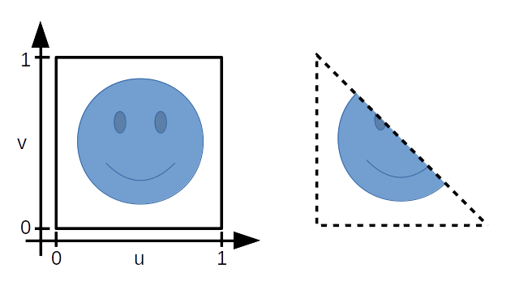

# Texturas e animação com OpenGL e Kotlin

[**Cleuton Sampaio**](https://github.com/cleuton)

## Renderizando com textura 3D


Agora sim, estamos conseguindo alguma coisa, certo? Estamos renderizando o planeta Terra e com rotação! Já assistiu ao [**VÍDEO**?](https://youtu.be/-L5425Z-hmI)

Fala sério! Se você acompanhou o [**exemplo anterior**](../gl_kotlin), esse aqui é relativamente simples. É uma questão de passarmos as coordenadas, de textura para UV Mapping, o buffer de textura e pronto!

O projeto está zipado aqui, nesta pasta do Github, junto com esse arquivo README.md!

Baixe o zip, descompacte e abra no **Android Studio** para acompanhar. 

## Texturas e UV Mapping

UV Mapping é o processo de mapear "pedaços" de uma textura às figuras formadas pelos vários vértices de um objeto a ser renderizado no OpenGL. Usamos "u" e "v" para designar as coordenadas da textura: 


(Imagem da Wikipedia, informações aqui https://pt.wikipedia.org/wiki/Ficheiro:UVMapping.png)

Geralmente, utilizamos polígonos simples, como triângulos, para formar nosso objeto a ser renderizado. Fizemos isso no exemplo anterior gerando uma esfera. 

Cada triângulo a ser renderizado tem vértices e fragmentos, e cada pedaço dele é associadao também às coordenadas "u" e "v" da imagem. 



Modificamos um pouco a geração da esfera para obter os valores de "u" e "v" de cada triângulo e colocá-los em um buffer de textura (arquivo Sphere.kt): 
```
    fun generate() {
        // Calcular vértices e normais:
        for (latNumber in 0..latitudeBands) {
            val theta = latNumber * Math.PI / latitudeBands
            val sinTheta = sin(theta)
            val cosTheta = cos(theta)
            for (longNumber in 0..longitudeBands) {
                val phi = longNumber * 2 * Math.PI / longitudeBands
                val sinPhi = sin(phi)
                val cosPhi = cos(phi)
                val x = cosPhi * sinTheta
                var y = cosTheta
                val z = sinPhi * sinTheta
                val u : Float = (1.0 - longNumber.toDouble() / longitudeBands.toDouble()).toFloat()
                val v : Float  = (1.0 - latNumber.toDouble() / latitudeBands.toDouble()).toFloat()
                textureCoordData.add(u)
                textureCoordData.add(v)
                normalData.add(x.toFloat())
                normalData.add(y.toFloat())
                normalData.add(z.toFloat())
                vertexPositionData.add((raio * x).toFloat())
                vertexPositionData.add((raio * y).toFloat())
                vertexPositionData.add((raio * z).toFloat())
                // Cor da esfera:
                vertexColors.add(cor[0].toFloat())
                vertexColors.add(cor[1].toFloat())
                vertexColors.add(cor[2].toFloat())
                vertexColors.add(cor[3].toFloat())
            }
        }
```

O resto continua igual. Note que eu nem mencionei qual é a textura. Ela será aplicada, esticada e a coordenada de cada triângulo que eu desenhar, estará associada às coordenadas "u","v" na textura a ser aplicada. 

É claro que eu tive que gerar mais um **buffer** para armazenar as coordenadas UV: 
```
        texturaCoordsBuffer = ByteBuffer.allocateDirect( // (# of coordinate values * 4 bytes per float)
            textureCoordData.size * 4
        ).run {
            order(ByteOrder.nativeOrder())
            asFloatBuffer().apply {
                put(textureCoordData.toFloatArray())
                position(0)
            }
        }
        ...
        var texturaVob = buffers[4]
        GLES20.glBindBuffer(GLES20.GL_ARRAY_BUFFER,texturaVob);
        checkGlError("glBindBuffer 5");
        GLES20.glBufferData(GLES20.GL_ARRAY_BUFFER,
            textureCoordData.size * 4,
            texturaCoordsBuffer,
            GLES20.GL_STATIC_DRAW)
        checkGlError("glBufferData 5")
```

## Carga da imagem

Eu usei uma imagem de textura para o planeta Terra, obtida da Internet. Eu a coloquei dentro do folder especial "src/main/res/raw":


Nesta pasta "res/raw" podemos guardar recursos que não devem ser manipulados pelo Android, como imagens de textura por exemplo. Para criá-la, basta selecionar a pasta "src/main/res", abrir o menu de contexto (botão direito) e selecionar **Android Resource Directory** escolhendo a opção **Resource Type = raw**.

Eu carrego a imagem na inicialização da esfera, em **Sphere.kt**: 
```
    private fun carregarImagem(): Bitmap? {
        var imagem: Bitmap? = null
        val opc : BitmapFactory.Options = BitmapFactory.Options()
        opc.inScaled = false
        opc.inPreferredConfig = Bitmap.Config.ARGB_8888
        imagem = BitmapFactory.decodeResource(this.context.resources, R.raw.terra_flipped, opc)
        return imagem
    }
```

Usei as classes do pacote **android.graphics** para ler e carregar o arquivo de textura. O método **decodeResource()** espera a origem do recurso, neste caso a pasta de recursos **raw**, e usei a classe especial **R** para identificar o arquivo: **R.raw.terra_flipped**, onde *terra_flipped* é o filename sem extensão. 

Além de carregar a imagem, tive que criar um **buffer de textura** no método **draw** da esfera: 
```
        // A imagem da textura em si

        GLES20.glGenTextures(1, texturas, 0)
        GLES20.glBindTexture(GLES20.GL_TEXTURE_2D, texturas[0])
        GLUtils.texImage2D(GLES20.GL_TEXTURE_2D, 0, textura, 0)
        GLES20.glTexParameteri(
            GLES20.GL_TEXTURE_2D, GLES20.GL_TEXTURE_MIN_FILTER,
            GLES20.GL_LINEAR_MIPMAP_NEAREST
        )
        GLES20.glTexParameteri(
            GLES20.GL_TEXTURE_2D,
            GLES20.GL_TEXTURE_MAG_FILTER,
            GLES20.GL_LINEAR
        )
        GLES20.glGenerateMipmap(GLES20.GL_TEXTURE_2D)
        hTextura = texturas[0]
```

Eu verei handers para buffers, associei com a textura a ser utilizada **GL_TEXTURE_2D**, passei alguns parâmetros, enviei os bytes da textura para o buffer e mandei o OpenGL gerar [**MipMap**](https://www.khronos.org/opengl/wiki/Texture#Mip_maps) que são versões menores da textura, para evitar problemas com escala da imagem.

## Renderização

Para renderizar a imagem usei esses dois **Shaders**: 

**Vertex Shader**
```
    	attribute vec3 aVertexPosition;
    	attribute vec3 aVertexNormal;
    	attribute vec2 aTextureCoord;
        uniform vec3 uLightDirection; // vec3(0.9, 0.99, 0.99);
	    uniform mat4 uMVMatrix;
    	uniform mat4 uPMatrix;
    	uniform mat4 uNormalMatrix;
    	
		varying vec2 vTextureCoord;
		varying vec3 vShading;
    	
	    void main(void) {
	    	vTextureCoord = aTextureCoord;
	    	highp vec3 uLightColor = vec3(0.80, 0.80, 0.80);
        	//highp vec3 uLightDirection = vec3(0.9, 0.99, 0.99);
        	highp vec3 ambientColor = vec3(0.1, 0.1, 0.1);
    	    gl_Position = uPMatrix * uMVMatrix * vec4(aVertexPosition, 1.0);
    	    vec4 xnormal = uNormalMatrix * vec4(aVertexNormal,0.0);
    	    float dotNormal = max(dot(normalize(xnormal.xyz),uLightDirection), 0.0);
    	    vShading = ambientColor + uLightColor * dotNormal;
    	}  
```

**Fragment Shader**
```
    	precision mediump float;
    	uniform sampler2D uTextureUnit;
    	varying vec2 vTextureCoord;
    	varying vec3 vShading;

	    void main(void) {
	    	vec4 textureColor = texture2D(uTextureUnit, vec2(vTextureCoord.s, vTextureCoord.t));
        	gl_FragColor = vec4(textureColor.rgb * vShading, textureColor.a);
    	}
```

Eu mudei algumas coisas e agora eu passo a coordenada da luz como um **uniform**: 
```
GPU: 
...
uniform vec3 uLightDirection; // vec3(0.9, 0.99, 0.99);
...

CPU: 
...
        var mTextureUniHandle = GLES20.glGetUniformLocation(program, "uTextureUnit")
        checkGlError("glGetUniformLocation uTextureUnit")
        if (mTextureUniHandle == -1) {
            throw RuntimeException("não localizei o atributo mTextureUniHandle")
        }
...
        // Direção da luz
        GLES20.glUniform3f(mLightDirHandle,1.0F,0.0F,0.0F)
...
        GLES20.glBindBuffer(GLES20.GL_ELEMENT_ARRAY_BUFFER, handlerIndex)
...
```

## Animação

Animar um modelo em **OpenGL** não é tarefa simples! Eu criei uma animação mais simples e realista possível, que faz a Terra parecer girar, recebendo a luz solar. Para isto, eu movimento o eixo **y** um grau por vez e renderizo novamente.

Para re-renderizar a imagem, eu uso o comando abaixo dentro do código da **PlanetActivity.kt**: 
```
...
gLView.requestRender()
...
```

Este comando invalida a view e força a invocação do método **onDrawFrame** do **GLrenderer.kt**. Para fazer rodar, eu vou incrementando o ângulo até 360, dentro de uma função com temporizador. Usei a classe **android.os.Handler**: 
```
        mHandler = Handler()
        mRunnable = Runnable {
            esfera.rotacao += 1
            if (esfera.rotacao >= 360) {
        	    esfera.rotacao = 0.0
            }
            gLView.requestRender()
            mHandler.postDelayed(
                mRunnable, // Runnable
                100 // Delay in milliseconds
            )
        }

        // Schedule the task to repeat after 1 second
        mHandler.postDelayed(
            mRunnable, // Runnable
            100 // Delay in milliseconds
        )
```

Se você precisar executar um código após um tempo, como no Javascript **setTimeout()** ou de tempos em tempos, como no **setInterval()** é isso o que vai usar. O Handler recebe uma instância de **Runnable**, que calcula o ângulo de rotação e requisita o redesenho da tela. Este Runnable também posta a sua própria invocação depois de um intervalo de 100 milissegundos. 

Então, dentro da **Activity**, eu agendo o Runnable do Handler para ser executado em 100 milissegundos. Assim, de 100 em 100 ele vai girando o ângulo da imagem.

Na hora de renderizar, ainda dentro do **onDrawFrame** eu posiciono a matriz de modelo com o novo ângulo: 
```
        for (element in elements) {
            var angulox = 0.0
            var anguloy = element.rotacao
            var anguloz = 0.0
            var modelMatrix = FloatArray(16)
            var modelViewMatrix = FloatArray(16)
            Matrix.setIdentityM(modelMatrix,0)
            Matrix.rotateM(modelMatrix,0,modelMatrix,0,angulox.toFloat(),1.0F,0.0F,0.0F)
            Matrix.rotateM(modelMatrix,0,modelMatrix,0,anguloy.toFloat(),0.0F,1.0F,0.0F)
            Matrix.rotateM(modelMatrix,0,modelMatrix,0,anguloz.toFloat(),0.0F,0.0F,1.0F)
            Matrix.multiplyMM(modelViewMatrix, 0, viewMatrix, 0, modelMatrix, 0)
            var normalsMatrix = FloatArray(16)
            Matrix.invertM(normalsMatrix,0,modelViewMatrix,0)
            Matrix.transposeM(normalsMatrix,0,normalsMatrix,0)
            element.draw(program,projectionMatrix,modelViewMatrix,normalsMatrix,viewMatrix,modelMatrix)
        }
```

Eu apliquei a rotação no ângulo **y** (cima) o que não altera a posição da luz. Agora, a matriz **model** faz sentido, não? Ela contém as transformações que queremos fazer no modelo. Depois, é combinada com a **view** (ajustada com o **LookAt**). 

Mas tem um problema: Estou alocando memória da GPU feito um doido. Como faço para evitar **Out Of Memory**? É preciso desalocar tudo e é o que eu faço antes de renderizar qualquer coisa, no método **draw** da **Sphere.kt**: 
```
        // Vamos criar VOBs (Vertex Object Buffers, na GPU) e mover os dados para a memória controlada por ela:

        clearAllBuffers()

        ...

    private fun clearAllBuffers() {
        GLES20.glDeleteBuffers(1, intArrayOf(1),0)
        checkGlError("glDeleteBuffers 0")
        GLES20.glDeleteBuffers(buffers.size, buffers, 0)
        checkGlError("glDeleteBuffers 1")
        GLES20.glDeleteTextures(texturas.size, texturas, 0)
        checkGlError("glDeleteTextures 1")
    }
```

Como eu aloquei todos os buffers em vetores, posso usar o **glDeleteBuffers** nos VOBs e na Textura alocados na GPU. Eu posso deletar um só buffer, o que demonstro com o primeiro comando, ou todos os buffers, que é o mais normal. 

